#  鐵達尼號生存預測
---
### 參考程式碼出處
[[資料分析&機器學習] 第4.1講 : Kaggle競賽-鐵達尼號生存預測'](https://medium.com/@yehjames/%E8%B3%87%E6%96%99%E5%88%86%E6%9E%90-%E6%A9%9F%E5%99%A8%E5%AD%B8%E7%BF%92-%E7%AC%AC4-1%E8%AC%9B-kaggle%E7%AB%B6%E8%B3%BD-%E9%90%B5%E9%81%94%E5%B0%BC%E8%99%9F%E7%94%9F%E5%AD%98%E9%A0%90%E6%B8%AC-%E5%89%8D16-%E6%8E%92%E5%90%8D-a8842fea7077) 
### 載入所需套件以及資料
資料下載處: [Titanic: Machine Learning from Disaster](https://www.kaggle.com/c/titanic/data)


```python
from sklearn import preprocessing 
from sklearn.model_selection import GridSearchCV 
from sklearn.ensemble import RandomForestClassifier 
from sklearn.ensemble import RandomForestRegressor

import warnings
import pandas as pd
import numpy as np
import matplotlib.pyplot as plt
import seaborn as sns

%matplotlib inline
pd.options.mode.chained_assignment = None
```


```python
train = pd.read_csv("Titanic/train.csv")
test = pd.read_csv("Titanic/test.csv")
submit = pd.read_csv('Titanic/gender_submission.csv')
```

### 查看train表格中前五項資料


```python
train.head(5)
```


<div>
<table border="1" class="dataframe">
  <thead>
    <tr style="text-align: right;">
      <th></th>
      <th>PassengerId</th>
      <th>Survived</th>
      <th>Pclass</th>
      <th>Name</th>
      <th>Sex</th>
      <th>Age</th>
      <th>SibSp</th>
      <th>Parch</th>
      <th>Ticket</th>
      <th>Fare</th>
      <th>Cabin</th>
      <th>Embarked</th>
    </tr>
  </thead>
  <tbody>
    <tr>
      <th>0</th>
      <td>1</td>
      <td>0</td>
      <td>3</td>
      <td>Braund, Mr. Owen Harris</td>
      <td>male</td>
      <td>22.0</td>
      <td>1</td>
      <td>0</td>
      <td>A/5 21171</td>
      <td>7.2500</td>
      <td>NaN</td>
      <td>S</td>
    </tr>
    <tr>
      <th>1</th>
      <td>2</td>
      <td>1</td>
      <td>1</td>
      <td>Cumings, Mrs. John Bradley (Florence Briggs Th...</td>
      <td>female</td>
      <td>38.0</td>
      <td>1</td>
      <td>0</td>
      <td>PC 17599</td>
      <td>71.2833</td>
      <td>C85</td>
      <td>C</td>
    </tr>
    <tr>
      <th>2</th>
      <td>3</td>
      <td>1</td>
      <td>3</td>
      <td>Heikkinen, Miss. Laina</td>
      <td>female</td>
      <td>26.0</td>
      <td>0</td>
      <td>0</td>
      <td>STON/O2. 3101282</td>
      <td>7.9250</td>
      <td>NaN</td>
      <td>S</td>
    </tr>
    <tr>
      <th>3</th>
      <td>4</td>
      <td>1</td>
      <td>1</td>
      <td>Futrelle, Mrs. Jacques Heath (Lily May Peel)</td>
      <td>female</td>
      <td>35.0</td>
      <td>1</td>
      <td>0</td>
      <td>113803</td>
      <td>53.1000</td>
      <td>C123</td>
      <td>S</td>
    </tr>
    <tr>
      <th>4</th>
      <td>5</td>
      <td>0</td>
      <td>3</td>
      <td>Allen, Mr. William Henry</td>
      <td>male</td>
      <td>35.0</td>
      <td>0</td>
      <td>0</td>
      <td>373450</td>
      <td>8.0500</td>
      <td>NaN</td>
      <td>S</td>
    </tr>
  </tbody>
</table>
</div>


### 使用info()函式，觀察train以及test資料是否有空值


```python
train.info()
```

    <class 'pandas.core.frame.DataFrame'>
    RangeIndex: 891 entries, 0 to 890
    Data columns (total 12 columns):
    PassengerId    891 non-null int64
    Survived       891 non-null int64
    Pclass         891 non-null int64
    Name           891 non-null object
    Sex            891 non-null object
    Age            714 non-null float64
    SibSp          891 non-null int64
    Parch          891 non-null int64
    Ticket         891 non-null object
    Fare           891 non-null float64
    Cabin          204 non-null object
    Embarked       889 non-null object
    dtypes: float64(2), int64(5), object(5)
    memory usage: 83.6+ KB
    

#### 可以發現Age、Cabin、Embarked皆有空值
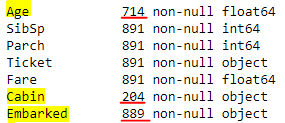


```python
test.info()
```

    <class 'pandas.core.frame.DataFrame'>
    RangeIndex: 418 entries, 0 to 417
    Data columns (total 11 columns):
    PassengerId    418 non-null int64
    Pclass         418 non-null int64
    Name           418 non-null object
    Sex            418 non-null object
    Age            332 non-null float64
    SibSp          418 non-null int64
    Parch          418 non-null int64
    Ticket         418 non-null object
    Fare           417 non-null float64
    Cabin          91 non-null object
    Embarked       418 non-null object
    dtypes: float64(2), int64(4), object(5)
    memory usage: 36.0+ KB
    

#### 可以發現Age、Fare、Cabin皆有空值
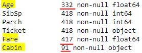

#### 使用Describe來觀察train以及test的資料分布


```python
train.describe()
```


<div>
<table border="1" class="dataframe">
  <thead>
    <tr style="text-align: right;">
      <th></th>
      <th>PassengerId</th>
      <th>Survived</th>
      <th>Pclass</th>
      <th>Age</th>
      <th>SibSp</th>
      <th>Parch</th>
      <th>Fare</th>
    </tr>
  </thead>
  <tbody>
    <tr>
      <th>count</th>
      <td>891.000000</td>
      <td>891.000000</td>
      <td>891.000000</td>
      <td>714.000000</td>
      <td>891.000000</td>
      <td>891.000000</td>
      <td>891.000000</td>
    </tr>
    <tr>
      <th>mean</th>
      <td>446.000000</td>
      <td>0.383838</td>
      <td>2.308642</td>
      <td>29.699118</td>
      <td>0.523008</td>
      <td>0.381594</td>
      <td>32.204208</td>
    </tr>
    <tr>
      <th>std</th>
      <td>257.353842</td>
      <td>0.486592</td>
      <td>0.836071</td>
      <td>14.526497</td>
      <td>1.102743</td>
      <td>0.806057</td>
      <td>49.693429</td>
    </tr>
    <tr>
      <th>min</th>
      <td>1.000000</td>
      <td>0.000000</td>
      <td>1.000000</td>
      <td>0.420000</td>
      <td>0.000000</td>
      <td>0.000000</td>
      <td>0.000000</td>
    </tr>
    <tr>
      <th>25%</th>
      <td>223.500000</td>
      <td>0.000000</td>
      <td>2.000000</td>
      <td>20.125000</td>
      <td>0.000000</td>
      <td>0.000000</td>
      <td>7.910400</td>
    </tr>
    <tr>
      <th>50%</th>
      <td>446.000000</td>
      <td>0.000000</td>
      <td>3.000000</td>
      <td>28.000000</td>
      <td>0.000000</td>
      <td>0.000000</td>
      <td>14.454200</td>
    </tr>
    <tr>
      <th>75%</th>
      <td>668.500000</td>
      <td>1.000000</td>
      <td>3.000000</td>
      <td>38.000000</td>
      <td>1.000000</td>
      <td>0.000000</td>
      <td>31.000000</td>
    </tr>
    <tr>
      <th>max</th>
      <td>891.000000</td>
      <td>1.000000</td>
      <td>3.000000</td>
      <td>80.000000</td>
      <td>8.000000</td>
      <td>6.000000</td>
      <td>512.329200</td>
    </tr>
  </tbody>
</table>
</div>


```python
test.describe()
```


<div>
<table border="1" class="dataframe">
  <thead>
    <tr style="text-align: right;">
      <th></th>
      <th>PassengerId</th>
      <th>Pclass</th>
      <th>Age</th>
      <th>SibSp</th>
      <th>Parch</th>
      <th>Fare</th>
    </tr>
  </thead>
  <tbody>
    <tr>
      <th>count</th>
      <td>418.000000</td>
      <td>418.000000</td>
      <td>332.000000</td>
      <td>418.000000</td>
      <td>418.000000</td>
      <td>417.000000</td>
    </tr>
    <tr>
      <th>mean</th>
      <td>1100.500000</td>
      <td>2.265550</td>
      <td>30.272590</td>
      <td>0.447368</td>
      <td>0.392344</td>
      <td>35.627188</td>
    </tr>
    <tr>
      <th>std</th>
      <td>120.810458</td>
      <td>0.841838</td>
      <td>14.181209</td>
      <td>0.896760</td>
      <td>0.981429</td>
      <td>55.907576</td>
    </tr>
    <tr>
      <th>min</th>
      <td>892.000000</td>
      <td>1.000000</td>
      <td>0.170000</td>
      <td>0.000000</td>
      <td>0.000000</td>
      <td>0.000000</td>
    </tr>
    <tr>
      <th>25%</th>
      <td>996.250000</td>
      <td>1.000000</td>
      <td>21.000000</td>
      <td>0.000000</td>
      <td>0.000000</td>
      <td>7.895800</td>
    </tr>
    <tr>
      <th>50%</th>
      <td>1100.500000</td>
      <td>3.000000</td>
      <td>27.000000</td>
      <td>0.000000</td>
      <td>0.000000</td>
      <td>14.454200</td>
    </tr>
    <tr>
      <th>75%</th>
      <td>1204.750000</td>
      <td>3.000000</td>
      <td>39.000000</td>
      <td>1.000000</td>
      <td>0.000000</td>
      <td>31.500000</td>
    </tr>
    <tr>
      <th>max</th>
      <td>1309.000000</td>
      <td>3.000000</td>
      <td>76.000000</td>
      <td>8.000000</td>
      <td>9.000000</td>
      <td>512.329200</td>
    </tr>
  </tbody>
</table>
</div>


### 將資料做合併


```python
data = train.append(test)
data
```


<div>
<table border="1" class="dataframe">
  <thead>
    <tr style="text-align: right;">
      <th></th>
      <th>Age</th>
      <th>Cabin</th>
      <th>Embarked</th>
      <th>Fare</th>
      <th>Name</th>
      <th>Parch</th>
      <th>PassengerId</th>
      <th>Pclass</th>
      <th>Sex</th>
      <th>SibSp</th>
      <th>Survived</th>
      <th>Ticket</th>
    </tr>
  </thead>
  <tbody>
    <tr>
      <th>0</th>
      <td>22.0</td>
      <td>NaN</td>
      <td>S</td>
      <td>7.2500</td>
      <td>Braund, Mr. Owen Harris</td>
      <td>0</td>
      <td>1</td>
      <td>3</td>
      <td>male</td>
      <td>1</td>
      <td>0.0</td>
      <td>A/5 21171</td>
    </tr>
    <tr>
      <th>1</th>
      <td>38.0</td>
      <td>C85</td>
      <td>C</td>
      <td>71.2833</td>
      <td>Cumings, Mrs. John Bradley (Florence Briggs Th...</td>
      <td>0</td>
      <td>2</td>
      <td>1</td>
      <td>female</td>
      <td>1</td>
      <td>1.0</td>
      <td>PC 17599</td>
    </tr>
    <tr>
      <th>2</th>
      <td>26.0</td>
      <td>NaN</td>
      <td>S</td>
      <td>7.9250</td>
      <td>Heikkinen, Miss. Laina</td>
      <td>0</td>
      <td>3</td>
      <td>3</td>
      <td>female</td>
      <td>0</td>
      <td>1.0</td>
      <td>STON/O2. 3101282</td>
    </tr>
    <tr>
      <th>3</th>
      <td>35.0</td>
      <td>C123</td>
      <td>S</td>
      <td>53.1000</td>
      <td>Futrelle, Mrs. Jacques Heath (Lily May Peel)</td>
      <td>0</td>
      <td>4</td>
      <td>1</td>
      <td>female</td>
      <td>1</td>
      <td>1.0</td>
      <td>113803</td>
    </tr>
    <tr>
      <th>4</th>
      <td>35.0</td>
      <td>NaN</td>
      <td>S</td>
      <td>8.0500</td>
      <td>Allen, Mr. William Henry</td>
      <td>0</td>
      <td>5</td>
      <td>3</td>
      <td>male</td>
      <td>0</td>
      <td>0.0</td>
      <td>373450</td>
    </tr>
    <tr>
      <th>5</th>
      <td>NaN</td>
      <td>NaN</td>
      <td>Q</td>
      <td>8.4583</td>
      <td>Moran, Mr. James</td>
      <td>0</td>
      <td>6</td>
      <td>3</td>
      <td>male</td>
      <td>0</td>
      <td>0.0</td>
      <td>330877</td>
    </tr>
    <tr>
      <th>6</th>
      <td>54.0</td>
      <td>E46</td>
      <td>S</td>
      <td>51.8625</td>
      <td>McCarthy, Mr. Timothy J</td>
      <td>0</td>
      <td>7</td>
      <td>1</td>
      <td>male</td>
      <td>0</td>
      <td>0.0</td>
      <td>17463</td>
    </tr>
    <tr>
      <th>7</th>
      <td>2.0</td>
      <td>NaN</td>
      <td>S</td>
      <td>21.0750</td>
      <td>Palsson, Master. Gosta Leonard</td>
      <td>1</td>
      <td>8</td>
      <td>3</td>
      <td>male</td>
      <td>3</td>
      <td>0.0</td>
      <td>349909</td>
    </tr>
    <tr>
      <th>8</th>
      <td>27.0</td>
      <td>NaN</td>
      <td>S</td>
      <td>11.1333</td>
      <td>Johnson, Mrs. Oscar W (Elisabeth Vilhelmina Berg)</td>
      <td>2</td>
      <td>9</td>
      <td>3</td>
      <td>female</td>
      <td>0</td>
      <td>1.0</td>
      <td>347742</td>
    </tr>
    <tr>
      <th>9</th>
      <td>14.0</td>
      <td>NaN</td>
      <td>C</td>
      <td>30.0708</td>
      <td>Nasser, Mrs. Nicholas (Adele Achem)</td>
      <td>0</td>
      <td>10</td>
      <td>2</td>
      <td>female</td>
      <td>1</td>
      <td>1.0</td>
      <td>237736</td>
    </tr>
    <tr>
      <th>10</th>
      <td>4.0</td>
      <td>G6</td>
      <td>S</td>
      <td>16.7000</td>
      <td>Sandstrom, Miss. Marguerite Rut</td>
      <td>1</td>
      <td>11</td>
      <td>3</td>
      <td>female</td>
      <td>1</td>
      <td>1.0</td>
      <td>PP 9549</td>
    </tr>
    <tr>
      <th>11</th>
      <td>58.0</td>
      <td>C103</td>
      <td>S</td>
      <td>26.5500</td>
      <td>Bonnell, Miss. Elizabeth</td>
      <td>0</td>
      <td>12</td>
      <td>1</td>
      <td>female</td>
      <td>0</td>
      <td>1.0</td>
      <td>113783</td>
    </tr>
    <tr>
      <th>12</th>
      <td>20.0</td>
      <td>NaN</td>
      <td>S</td>
      <td>8.0500</td>
      <td>Saundercock, Mr. William Henry</td>
      <td>0</td>
      <td>13</td>
      <td>3</td>
      <td>male</td>
      <td>0</td>
      <td>0.0</td>
      <td>A/5. 2151</td>
    </tr>
    <tr>
      <th>13</th>
      <td>39.0</td>
      <td>NaN</td>
      <td>S</td>
      <td>31.2750</td>
      <td>Andersson, Mr. Anders Johan</td>
      <td>5</td>
      <td>14</td>
      <td>3</td>
      <td>male</td>
      <td>1</td>
      <td>0.0</td>
      <td>347082</td>
    </tr>
    <tr>
      <th>14</th>
      <td>14.0</td>
      <td>NaN</td>
      <td>S</td>
      <td>7.8542</td>
      <td>Vestrom, Miss. Hulda Amanda Adolfina</td>
      <td>0</td>
      <td>15</td>
      <td>3</td>
      <td>female</td>
      <td>0</td>
      <td>0.0</td>
      <td>350406</td>
    </tr>
    <tr>
      <th>15</th>
      <td>55.0</td>
      <td>NaN</td>
      <td>S</td>
      <td>16.0000</td>
      <td>Hewlett, Mrs. (Mary D Kingcome)</td>
      <td>0</td>
      <td>16</td>
      <td>2</td>
      <td>female</td>
      <td>0</td>
      <td>1.0</td>
      <td>248706</td>
    </tr>
    <tr>
      <th>16</th>
      <td>2.0</td>
      <td>NaN</td>
      <td>Q</td>
      <td>29.1250</td>
      <td>Rice, Master. Eugene</td>
      <td>1</td>
      <td>17</td>
      <td>3</td>
      <td>male</td>
      <td>4</td>
      <td>0.0</td>
      <td>382652</td>
    </tr>
    <tr>
      <th>17</th>
      <td>NaN</td>
      <td>NaN</td>
      <td>S</td>
      <td>13.0000</td>
      <td>Williams, Mr. Charles Eugene</td>
      <td>0</td>
      <td>18</td>
      <td>2</td>
      <td>male</td>
      <td>0</td>
      <td>1.0</td>
      <td>244373</td>
    </tr>
    <tr>
      <th>18</th>
      <td>31.0</td>
      <td>NaN</td>
      <td>S</td>
      <td>18.0000</td>
      <td>Vander Planke, Mrs. Julius (Emelia Maria Vande...</td>
      <td>0</td>
      <td>19</td>
      <td>3</td>
      <td>female</td>
      <td>1</td>
      <td>0.0</td>
      <td>345763</td>
    </tr>
    <tr>
      <th>19</th>
      <td>NaN</td>
      <td>NaN</td>
      <td>C</td>
      <td>7.2250</td>
      <td>Masselmani, Mrs. Fatima</td>
      <td>0</td>
      <td>20</td>
      <td>3</td>
      <td>female</td>
      <td>0</td>
      <td>1.0</td>
      <td>2649</td>
    </tr>
    <tr>
      <th>20</th>
      <td>35.0</td>
      <td>NaN</td>
      <td>S</td>
      <td>26.0000</td>
      <td>Fynney, Mr. Joseph J</td>
      <td>0</td>
      <td>21</td>
      <td>2</td>
      <td>male</td>
      <td>0</td>
      <td>0.0</td>
      <td>239865</td>
    </tr>
    <tr>
      <th>21</th>
      <td>34.0</td>
      <td>D56</td>
      <td>S</td>
      <td>13.0000</td>
      <td>Beesley, Mr. Lawrence</td>
      <td>0</td>
      <td>22</td>
      <td>2</td>
      <td>male</td>
      <td>0</td>
      <td>1.0</td>
      <td>248698</td>
    </tr>
    <tr>
      <th>22</th>
      <td>15.0</td>
      <td>NaN</td>
      <td>Q</td>
      <td>8.0292</td>
      <td>McGowan, Miss. Anna "Annie"</td>
      <td>0</td>
      <td>23</td>
      <td>3</td>
      <td>female</td>
      <td>0</td>
      <td>1.0</td>
      <td>330923</td>
    </tr>
    <tr>
      <th>23</th>
      <td>28.0</td>
      <td>A6</td>
      <td>S</td>
      <td>35.5000</td>
      <td>Sloper, Mr. William Thompson</td>
      <td>0</td>
      <td>24</td>
      <td>1</td>
      <td>male</td>
      <td>0</td>
      <td>1.0</td>
      <td>113788</td>
    </tr>
    <tr>
      <th>24</th>
      <td>8.0</td>
      <td>NaN</td>
      <td>S</td>
      <td>21.0750</td>
      <td>Palsson, Miss. Torborg Danira</td>
      <td>1</td>
      <td>25</td>
      <td>3</td>
      <td>female</td>
      <td>3</td>
      <td>0.0</td>
      <td>349909</td>
    </tr>
    <tr>
      <th>25</th>
      <td>38.0</td>
      <td>NaN</td>
      <td>S</td>
      <td>31.3875</td>
      <td>Asplund, Mrs. Carl Oscar (Selma Augusta Emilia...</td>
      <td>5</td>
      <td>26</td>
      <td>3</td>
      <td>female</td>
      <td>1</td>
      <td>1.0</td>
      <td>347077</td>
    </tr>
    <tr>
      <th>26</th>
      <td>NaN</td>
      <td>NaN</td>
      <td>C</td>
      <td>7.2250</td>
      <td>Emir, Mr. Farred Chehab</td>
      <td>0</td>
      <td>27</td>
      <td>3</td>
      <td>male</td>
      <td>0</td>
      <td>0.0</td>
      <td>2631</td>
    </tr>
    <tr>
      <th>27</th>
      <td>19.0</td>
      <td>C23 C25 C27</td>
      <td>S</td>
      <td>263.0000</td>
      <td>Fortune, Mr. Charles Alexander</td>
      <td>2</td>
      <td>28</td>
      <td>1</td>
      <td>male</td>
      <td>3</td>
      <td>0.0</td>
      <td>19950</td>
    </tr>
    <tr>
      <th>28</th>
      <td>NaN</td>
      <td>NaN</td>
      <td>Q</td>
      <td>7.8792</td>
      <td>O'Dwyer, Miss. Ellen "Nellie"</td>
      <td>0</td>
      <td>29</td>
      <td>3</td>
      <td>female</td>
      <td>0</td>
      <td>1.0</td>
      <td>330959</td>
    </tr>
    <tr>
      <th>29</th>
      <td>NaN</td>
      <td>NaN</td>
      <td>S</td>
      <td>7.8958</td>
      <td>Todoroff, Mr. Lalio</td>
      <td>0</td>
      <td>30</td>
      <td>3</td>
      <td>male</td>
      <td>0</td>
      <td>0.0</td>
      <td>349216</td>
    </tr>
    <tr>
      <th>...</th>
      <td>...</td>
      <td>...</td>
      <td>...</td>
      <td>...</td>
      <td>...</td>
      <td>...</td>
      <td>...</td>
      <td>...</td>
      <td>...</td>
      <td>...</td>
      <td>...</td>
      <td>...</td>
    </tr>
    <tr>
      <th>388</th>
      <td>21.0</td>
      <td>NaN</td>
      <td>Q</td>
      <td>7.7500</td>
      <td>Canavan, Mr. Patrick</td>
      <td>0</td>
      <td>1280</td>
      <td>3</td>
      <td>male</td>
      <td>0</td>
      <td>NaN</td>
      <td>364858</td>
    </tr>
    <tr>
      <th>389</th>
      <td>6.0</td>
      <td>NaN</td>
      <td>S</td>
      <td>21.0750</td>
      <td>Palsson, Master. Paul Folke</td>
      <td>1</td>
      <td>1281</td>
      <td>3</td>
      <td>male</td>
      <td>3</td>
      <td>NaN</td>
      <td>349909</td>
    </tr>
    <tr>
      <th>390</th>
      <td>23.0</td>
      <td>B24</td>
      <td>S</td>
      <td>93.5000</td>
      <td>Payne, Mr. Vivian Ponsonby</td>
      <td>0</td>
      <td>1282</td>
      <td>1</td>
      <td>male</td>
      <td>0</td>
      <td>NaN</td>
      <td>12749</td>
    </tr>
    <tr>
      <th>391</th>
      <td>51.0</td>
      <td>D28</td>
      <td>S</td>
      <td>39.4000</td>
      <td>Lines, Mrs. Ernest H (Elizabeth Lindsey James)</td>
      <td>1</td>
      <td>1283</td>
      <td>1</td>
      <td>female</td>
      <td>0</td>
      <td>NaN</td>
      <td>PC 17592</td>
    </tr>
    <tr>
      <th>392</th>
      <td>13.0</td>
      <td>NaN</td>
      <td>S</td>
      <td>20.2500</td>
      <td>Abbott, Master. Eugene Joseph</td>
      <td>2</td>
      <td>1284</td>
      <td>3</td>
      <td>male</td>
      <td>0</td>
      <td>NaN</td>
      <td>C.A. 2673</td>
    </tr>
    <tr>
      <th>393</th>
      <td>47.0</td>
      <td>NaN</td>
      <td>S</td>
      <td>10.5000</td>
      <td>Gilbert, Mr. William</td>
      <td>0</td>
      <td>1285</td>
      <td>2</td>
      <td>male</td>
      <td>0</td>
      <td>NaN</td>
      <td>C.A. 30769</td>
    </tr>
    <tr>
      <th>394</th>
      <td>29.0</td>
      <td>NaN</td>
      <td>S</td>
      <td>22.0250</td>
      <td>Kink-Heilmann, Mr. Anton</td>
      <td>1</td>
      <td>1286</td>
      <td>3</td>
      <td>male</td>
      <td>3</td>
      <td>NaN</td>
      <td>315153</td>
    </tr>
    <tr>
      <th>395</th>
      <td>18.0</td>
      <td>C31</td>
      <td>S</td>
      <td>60.0000</td>
      <td>Smith, Mrs. Lucien Philip (Mary Eloise Hughes)</td>
      <td>0</td>
      <td>1287</td>
      <td>1</td>
      <td>female</td>
      <td>1</td>
      <td>NaN</td>
      <td>13695</td>
    </tr>
    <tr>
      <th>396</th>
      <td>24.0</td>
      <td>NaN</td>
      <td>Q</td>
      <td>7.2500</td>
      <td>Colbert, Mr. Patrick</td>
      <td>0</td>
      <td>1288</td>
      <td>3</td>
      <td>male</td>
      <td>0</td>
      <td>NaN</td>
      <td>371109</td>
    </tr>
    <tr>
      <th>397</th>
      <td>48.0</td>
      <td>B41</td>
      <td>C</td>
      <td>79.2000</td>
      <td>Frolicher-Stehli, Mrs. Maxmillian (Margaretha ...</td>
      <td>1</td>
      <td>1289</td>
      <td>1</td>
      <td>female</td>
      <td>1</td>
      <td>NaN</td>
      <td>13567</td>
    </tr>
    <tr>
      <th>398</th>
      <td>22.0</td>
      <td>NaN</td>
      <td>S</td>
      <td>7.7750</td>
      <td>Larsson-Rondberg, Mr. Edvard A</td>
      <td>0</td>
      <td>1290</td>
      <td>3</td>
      <td>male</td>
      <td>0</td>
      <td>NaN</td>
      <td>347065</td>
    </tr>
    <tr>
      <th>399</th>
      <td>31.0</td>
      <td>NaN</td>
      <td>Q</td>
      <td>7.7333</td>
      <td>Conlon, Mr. Thomas Henry</td>
      <td>0</td>
      <td>1291</td>
      <td>3</td>
      <td>male</td>
      <td>0</td>
      <td>NaN</td>
      <td>21332</td>
    </tr>
    <tr>
      <th>400</th>
      <td>30.0</td>
      <td>C7</td>
      <td>S</td>
      <td>164.8667</td>
      <td>Bonnell, Miss. Caroline</td>
      <td>0</td>
      <td>1292</td>
      <td>1</td>
      <td>female</td>
      <td>0</td>
      <td>NaN</td>
      <td>36928</td>
    </tr>
    <tr>
      <th>401</th>
      <td>38.0</td>
      <td>NaN</td>
      <td>S</td>
      <td>21.0000</td>
      <td>Gale, Mr. Harry</td>
      <td>0</td>
      <td>1293</td>
      <td>2</td>
      <td>male</td>
      <td>1</td>
      <td>NaN</td>
      <td>28664</td>
    </tr>
    <tr>
      <th>402</th>
      <td>22.0</td>
      <td>NaN</td>
      <td>C</td>
      <td>59.4000</td>
      <td>Gibson, Miss. Dorothy Winifred</td>
      <td>1</td>
      <td>1294</td>
      <td>1</td>
      <td>female</td>
      <td>0</td>
      <td>NaN</td>
      <td>112378</td>
    </tr>
    <tr>
      <th>403</th>
      <td>17.0</td>
      <td>NaN</td>
      <td>S</td>
      <td>47.1000</td>
      <td>Carrau, Mr. Jose Pedro</td>
      <td>0</td>
      <td>1295</td>
      <td>1</td>
      <td>male</td>
      <td>0</td>
      <td>NaN</td>
      <td>113059</td>
    </tr>
    <tr>
      <th>404</th>
      <td>43.0</td>
      <td>D40</td>
      <td>C</td>
      <td>27.7208</td>
      <td>Frauenthal, Mr. Isaac Gerald</td>
      <td>0</td>
      <td>1296</td>
      <td>1</td>
      <td>male</td>
      <td>1</td>
      <td>NaN</td>
      <td>17765</td>
    </tr>
    <tr>
      <th>405</th>
      <td>20.0</td>
      <td>D38</td>
      <td>C</td>
      <td>13.8625</td>
      <td>Nourney, Mr. Alfred (Baron von Drachstedt")"</td>
      <td>0</td>
      <td>1297</td>
      <td>2</td>
      <td>male</td>
      <td>0</td>
      <td>NaN</td>
      <td>SC/PARIS 2166</td>
    </tr>
    <tr>
      <th>406</th>
      <td>23.0</td>
      <td>NaN</td>
      <td>S</td>
      <td>10.5000</td>
      <td>Ware, Mr. William Jeffery</td>
      <td>0</td>
      <td>1298</td>
      <td>2</td>
      <td>male</td>
      <td>1</td>
      <td>NaN</td>
      <td>28666</td>
    </tr>
    <tr>
      <th>407</th>
      <td>50.0</td>
      <td>C80</td>
      <td>C</td>
      <td>211.5000</td>
      <td>Widener, Mr. George Dunton</td>
      <td>1</td>
      <td>1299</td>
      <td>1</td>
      <td>male</td>
      <td>1</td>
      <td>NaN</td>
      <td>113503</td>
    </tr>
    <tr>
      <th>408</th>
      <td>NaN</td>
      <td>NaN</td>
      <td>Q</td>
      <td>7.7208</td>
      <td>Riordan, Miss. Johanna Hannah""</td>
      <td>0</td>
      <td>1300</td>
      <td>3</td>
      <td>female</td>
      <td>0</td>
      <td>NaN</td>
      <td>334915</td>
    </tr>
    <tr>
      <th>409</th>
      <td>3.0</td>
      <td>NaN</td>
      <td>S</td>
      <td>13.7750</td>
      <td>Peacock, Miss. Treasteall</td>
      <td>1</td>
      <td>1301</td>
      <td>3</td>
      <td>female</td>
      <td>1</td>
      <td>NaN</td>
      <td>SOTON/O.Q. 3101315</td>
    </tr>
    <tr>
      <th>410</th>
      <td>NaN</td>
      <td>NaN</td>
      <td>Q</td>
      <td>7.7500</td>
      <td>Naughton, Miss. Hannah</td>
      <td>0</td>
      <td>1302</td>
      <td>3</td>
      <td>female</td>
      <td>0</td>
      <td>NaN</td>
      <td>365237</td>
    </tr>
    <tr>
      <th>411</th>
      <td>37.0</td>
      <td>C78</td>
      <td>Q</td>
      <td>90.0000</td>
      <td>Minahan, Mrs. William Edward (Lillian E Thorpe)</td>
      <td>0</td>
      <td>1303</td>
      <td>1</td>
      <td>female</td>
      <td>1</td>
      <td>NaN</td>
      <td>19928</td>
    </tr>
    <tr>
      <th>412</th>
      <td>28.0</td>
      <td>NaN</td>
      <td>S</td>
      <td>7.7750</td>
      <td>Henriksson, Miss. Jenny Lovisa</td>
      <td>0</td>
      <td>1304</td>
      <td>3</td>
      <td>female</td>
      <td>0</td>
      <td>NaN</td>
      <td>347086</td>
    </tr>
    <tr>
      <th>413</th>
      <td>NaN</td>
      <td>NaN</td>
      <td>S</td>
      <td>8.0500</td>
      <td>Spector, Mr. Woolf</td>
      <td>0</td>
      <td>1305</td>
      <td>3</td>
      <td>male</td>
      <td>0</td>
      <td>NaN</td>
      <td>A.5. 3236</td>
    </tr>
    <tr>
      <th>414</th>
      <td>39.0</td>
      <td>C105</td>
      <td>C</td>
      <td>108.9000</td>
      <td>Oliva y Ocana, Dona. Fermina</td>
      <td>0</td>
      <td>1306</td>
      <td>1</td>
      <td>female</td>
      <td>0</td>
      <td>NaN</td>
      <td>PC 17758</td>
    </tr>
    <tr>
      <th>415</th>
      <td>38.5</td>
      <td>NaN</td>
      <td>S</td>
      <td>7.2500</td>
      <td>Saether, Mr. Simon Sivertsen</td>
      <td>0</td>
      <td>1307</td>
      <td>3</td>
      <td>male</td>
      <td>0</td>
      <td>NaN</td>
      <td>SOTON/O.Q. 3101262</td>
    </tr>
    <tr>
      <th>416</th>
      <td>NaN</td>
      <td>NaN</td>
      <td>S</td>
      <td>8.0500</td>
      <td>Ware, Mr. Frederick</td>
      <td>0</td>
      <td>1308</td>
      <td>3</td>
      <td>male</td>
      <td>0</td>
      <td>NaN</td>
      <td>359309</td>
    </tr>
    <tr>
      <th>417</th>
      <td>NaN</td>
      <td>NaN</td>
      <td>C</td>
      <td>22.3583</td>
      <td>Peter, Master. Michael J</td>
      <td>1</td>
      <td>1309</td>
      <td>3</td>
      <td>male</td>
      <td>1</td>
      <td>NaN</td>
      <td>2668</td>
    </tr>
  </tbody>
</table>
<p>1309 rows × 12 columns</p>
</div>


### 由於使用append合併之後會造成index重複問題，因此要將index重新設定


```python
data.reset_index(inplace=True, drop=True)
data
```


<div>
<table border="1" class="dataframe">
  <thead>
    <tr style="text-align: right;">
      <th></th>
      <th>Age</th>
      <th>Cabin</th>
      <th>Embarked</th>
      <th>Fare</th>
      <th>Name</th>
      <th>Parch</th>
      <th>PassengerId</th>
      <th>Pclass</th>
      <th>Sex</th>
      <th>SibSp</th>
      <th>Survived</th>
      <th>Ticket</th>
    </tr>
  </thead>
  <tbody>
    <tr>
      <th>0</th>
      <td>22.0</td>
      <td>NaN</td>
      <td>S</td>
      <td>7.2500</td>
      <td>Braund, Mr. Owen Harris</td>
      <td>0</td>
      <td>1</td>
      <td>3</td>
      <td>male</td>
      <td>1</td>
      <td>0.0</td>
      <td>A/5 21171</td>
    </tr>
    <tr>
      <th>1</th>
      <td>38.0</td>
      <td>C85</td>
      <td>C</td>
      <td>71.2833</td>
      <td>Cumings, Mrs. John Bradley (Florence Briggs Th...</td>
      <td>0</td>
      <td>2</td>
      <td>1</td>
      <td>female</td>
      <td>1</td>
      <td>1.0</td>
      <td>PC 17599</td>
    </tr>
    <tr>
      <th>2</th>
      <td>26.0</td>
      <td>NaN</td>
      <td>S</td>
      <td>7.9250</td>
      <td>Heikkinen, Miss. Laina</td>
      <td>0</td>
      <td>3</td>
      <td>3</td>
      <td>female</td>
      <td>0</td>
      <td>1.0</td>
      <td>STON/O2. 3101282</td>
    </tr>
    <tr>
      <th>3</th>
      <td>35.0</td>
      <td>C123</td>
      <td>S</td>
      <td>53.1000</td>
      <td>Futrelle, Mrs. Jacques Heath (Lily May Peel)</td>
      <td>0</td>
      <td>4</td>
      <td>1</td>
      <td>female</td>
      <td>1</td>
      <td>1.0</td>
      <td>113803</td>
    </tr>
    <tr>
      <th>4</th>
      <td>35.0</td>
      <td>NaN</td>
      <td>S</td>
      <td>8.0500</td>
      <td>Allen, Mr. William Henry</td>
      <td>0</td>
      <td>5</td>
      <td>3</td>
      <td>male</td>
      <td>0</td>
      <td>0.0</td>
      <td>373450</td>
    </tr>
    <tr>
      <th>5</th>
      <td>NaN</td>
      <td>NaN</td>
      <td>Q</td>
      <td>8.4583</td>
      <td>Moran, Mr. James</td>
      <td>0</td>
      <td>6</td>
      <td>3</td>
      <td>male</td>
      <td>0</td>
      <td>0.0</td>
      <td>330877</td>
    </tr>
    <tr>
      <th>6</th>
      <td>54.0</td>
      <td>E46</td>
      <td>S</td>
      <td>51.8625</td>
      <td>McCarthy, Mr. Timothy J</td>
      <td>0</td>
      <td>7</td>
      <td>1</td>
      <td>male</td>
      <td>0</td>
      <td>0.0</td>
      <td>17463</td>
    </tr>
    <tr>
      <th>7</th>
      <td>2.0</td>
      <td>NaN</td>
      <td>S</td>
      <td>21.0750</td>
      <td>Palsson, Master. Gosta Leonard</td>
      <td>1</td>
      <td>8</td>
      <td>3</td>
      <td>male</td>
      <td>3</td>
      <td>0.0</td>
      <td>349909</td>
    </tr>
    <tr>
      <th>8</th>
      <td>27.0</td>
      <td>NaN</td>
      <td>S</td>
      <td>11.1333</td>
      <td>Johnson, Mrs. Oscar W (Elisabeth Vilhelmina Berg)</td>
      <td>2</td>
      <td>9</td>
      <td>3</td>
      <td>female</td>
      <td>0</td>
      <td>1.0</td>
      <td>347742</td>
    </tr>
    <tr>
      <th>9</th>
      <td>14.0</td>
      <td>NaN</td>
      <td>C</td>
      <td>30.0708</td>
      <td>Nasser, Mrs. Nicholas (Adele Achem)</td>
      <td>0</td>
      <td>10</td>
      <td>2</td>
      <td>female</td>
      <td>1</td>
      <td>1.0</td>
      <td>237736</td>
    </tr>
    <tr>
      <th>10</th>
      <td>4.0</td>
      <td>G6</td>
      <td>S</td>
      <td>16.7000</td>
      <td>Sandstrom, Miss. Marguerite Rut</td>
      <td>1</td>
      <td>11</td>
      <td>3</td>
      <td>female</td>
      <td>1</td>
      <td>1.0</td>
      <td>PP 9549</td>
    </tr>
    <tr>
      <th>11</th>
      <td>58.0</td>
      <td>C103</td>
      <td>S</td>
      <td>26.5500</td>
      <td>Bonnell, Miss. Elizabeth</td>
      <td>0</td>
      <td>12</td>
      <td>1</td>
      <td>female</td>
      <td>0</td>
      <td>1.0</td>
      <td>113783</td>
    </tr>
    <tr>
      <th>12</th>
      <td>20.0</td>
      <td>NaN</td>
      <td>S</td>
      <td>8.0500</td>
      <td>Saundercock, Mr. William Henry</td>
      <td>0</td>
      <td>13</td>
      <td>3</td>
      <td>male</td>
      <td>0</td>
      <td>0.0</td>
      <td>A/5. 2151</td>
    </tr>
    <tr>
      <th>13</th>
      <td>39.0</td>
      <td>NaN</td>
      <td>S</td>
      <td>31.2750</td>
      <td>Andersson, Mr. Anders Johan</td>
      <td>5</td>
      <td>14</td>
      <td>3</td>
      <td>male</td>
      <td>1</td>
      <td>0.0</td>
      <td>347082</td>
    </tr>
    <tr>
      <th>14</th>
      <td>14.0</td>
      <td>NaN</td>
      <td>S</td>
      <td>7.8542</td>
      <td>Vestrom, Miss. Hulda Amanda Adolfina</td>
      <td>0</td>
      <td>15</td>
      <td>3</td>
      <td>female</td>
      <td>0</td>
      <td>0.0</td>
      <td>350406</td>
    </tr>
    <tr>
      <th>15</th>
      <td>55.0</td>
      <td>NaN</td>
      <td>S</td>
      <td>16.0000</td>
      <td>Hewlett, Mrs. (Mary D Kingcome)</td>
      <td>0</td>
      <td>16</td>
      <td>2</td>
      <td>female</td>
      <td>0</td>
      <td>1.0</td>
      <td>248706</td>
    </tr>
    <tr>
      <th>16</th>
      <td>2.0</td>
      <td>NaN</td>
      <td>Q</td>
      <td>29.1250</td>
      <td>Rice, Master. Eugene</td>
      <td>1</td>
      <td>17</td>
      <td>3</td>
      <td>male</td>
      <td>4</td>
      <td>0.0</td>
      <td>382652</td>
    </tr>
    <tr>
      <th>17</th>
      <td>NaN</td>
      <td>NaN</td>
      <td>S</td>
      <td>13.0000</td>
      <td>Williams, Mr. Charles Eugene</td>
      <td>0</td>
      <td>18</td>
      <td>2</td>
      <td>male</td>
      <td>0</td>
      <td>1.0</td>
      <td>244373</td>
    </tr>
    <tr>
      <th>18</th>
      <td>31.0</td>
      <td>NaN</td>
      <td>S</td>
      <td>18.0000</td>
      <td>Vander Planke, Mrs. Julius (Emelia Maria Vande...</td>
      <td>0</td>
      <td>19</td>
      <td>3</td>
      <td>female</td>
      <td>1</td>
      <td>0.0</td>
      <td>345763</td>
    </tr>
    <tr>
      <th>19</th>
      <td>NaN</td>
      <td>NaN</td>
      <td>C</td>
      <td>7.2250</td>
      <td>Masselmani, Mrs. Fatima</td>
      <td>0</td>
      <td>20</td>
      <td>3</td>
      <td>female</td>
      <td>0</td>
      <td>1.0</td>
      <td>2649</td>
    </tr>
    <tr>
      <th>20</th>
      <td>35.0</td>
      <td>NaN</td>
      <td>S</td>
      <td>26.0000</td>
      <td>Fynney, Mr. Joseph J</td>
      <td>0</td>
      <td>21</td>
      <td>2</td>
      <td>male</td>
      <td>0</td>
      <td>0.0</td>
      <td>239865</td>
    </tr>
    <tr>
      <th>21</th>
      <td>34.0</td>
      <td>D56</td>
      <td>S</td>
      <td>13.0000</td>
      <td>Beesley, Mr. Lawrence</td>
      <td>0</td>
      <td>22</td>
      <td>2</td>
      <td>male</td>
      <td>0</td>
      <td>1.0</td>
      <td>248698</td>
    </tr>
    <tr>
      <th>22</th>
      <td>15.0</td>
      <td>NaN</td>
      <td>Q</td>
      <td>8.0292</td>
      <td>McGowan, Miss. Anna "Annie"</td>
      <td>0</td>
      <td>23</td>
      <td>3</td>
      <td>female</td>
      <td>0</td>
      <td>1.0</td>
      <td>330923</td>
    </tr>
    <tr>
      <th>23</th>
      <td>28.0</td>
      <td>A6</td>
      <td>S</td>
      <td>35.5000</td>
      <td>Sloper, Mr. William Thompson</td>
      <td>0</td>
      <td>24</td>
      <td>1</td>
      <td>male</td>
      <td>0</td>
      <td>1.0</td>
      <td>113788</td>
    </tr>
    <tr>
      <th>24</th>
      <td>8.0</td>
      <td>NaN</td>
      <td>S</td>
      <td>21.0750</td>
      <td>Palsson, Miss. Torborg Danira</td>
      <td>1</td>
      <td>25</td>
      <td>3</td>
      <td>female</td>
      <td>3</td>
      <td>0.0</td>
      <td>349909</td>
    </tr>
    <tr>
      <th>25</th>
      <td>38.0</td>
      <td>NaN</td>
      <td>S</td>
      <td>31.3875</td>
      <td>Asplund, Mrs. Carl Oscar (Selma Augusta Emilia...</td>
      <td>5</td>
      <td>26</td>
      <td>3</td>
      <td>female</td>
      <td>1</td>
      <td>1.0</td>
      <td>347077</td>
    </tr>
    <tr>
      <th>26</th>
      <td>NaN</td>
      <td>NaN</td>
      <td>C</td>
      <td>7.2250</td>
      <td>Emir, Mr. Farred Chehab</td>
      <td>0</td>
      <td>27</td>
      <td>3</td>
      <td>male</td>
      <td>0</td>
      <td>0.0</td>
      <td>2631</td>
    </tr>
    <tr>
      <th>27</th>
      <td>19.0</td>
      <td>C23 C25 C27</td>
      <td>S</td>
      <td>263.0000</td>
      <td>Fortune, Mr. Charles Alexander</td>
      <td>2</td>
      <td>28</td>
      <td>1</td>
      <td>male</td>
      <td>3</td>
      <td>0.0</td>
      <td>19950</td>
    </tr>
    <tr>
      <th>28</th>
      <td>NaN</td>
      <td>NaN</td>
      <td>Q</td>
      <td>7.8792</td>
      <td>O'Dwyer, Miss. Ellen "Nellie"</td>
      <td>0</td>
      <td>29</td>
      <td>3</td>
      <td>female</td>
      <td>0</td>
      <td>1.0</td>
      <td>330959</td>
    </tr>
    <tr>
      <th>29</th>
      <td>NaN</td>
      <td>NaN</td>
      <td>S</td>
      <td>7.8958</td>
      <td>Todoroff, Mr. Lalio</td>
      <td>0</td>
      <td>30</td>
      <td>3</td>
      <td>male</td>
      <td>0</td>
      <td>0.0</td>
      <td>349216</td>
    </tr>
    <tr>
      <th>...</th>
      <td>...</td>
      <td>...</td>
      <td>...</td>
      <td>...</td>
      <td>...</td>
      <td>...</td>
      <td>...</td>
      <td>...</td>
      <td>...</td>
      <td>...</td>
      <td>...</td>
      <td>...</td>
    </tr>
    <tr>
      <th>1279</th>
      <td>21.0</td>
      <td>NaN</td>
      <td>Q</td>
      <td>7.7500</td>
      <td>Canavan, Mr. Patrick</td>
      <td>0</td>
      <td>1280</td>
      <td>3</td>
      <td>male</td>
      <td>0</td>
      <td>NaN</td>
      <td>364858</td>
    </tr>
    <tr>
      <th>1280</th>
      <td>6.0</td>
      <td>NaN</td>
      <td>S</td>
      <td>21.0750</td>
      <td>Palsson, Master. Paul Folke</td>
      <td>1</td>
      <td>1281</td>
      <td>3</td>
      <td>male</td>
      <td>3</td>
      <td>NaN</td>
      <td>349909</td>
    </tr>
    <tr>
      <th>1281</th>
      <td>23.0</td>
      <td>B24</td>
      <td>S</td>
      <td>93.5000</td>
      <td>Payne, Mr. Vivian Ponsonby</td>
      <td>0</td>
      <td>1282</td>
      <td>1</td>
      <td>male</td>
      <td>0</td>
      <td>NaN</td>
      <td>12749</td>
    </tr>
    <tr>
      <th>1282</th>
      <td>51.0</td>
      <td>D28</td>
      <td>S</td>
      <td>39.4000</td>
      <td>Lines, Mrs. Ernest H (Elizabeth Lindsey James)</td>
      <td>1</td>
      <td>1283</td>
      <td>1</td>
      <td>female</td>
      <td>0</td>
      <td>NaN</td>
      <td>PC 17592</td>
    </tr>
    <tr>
      <th>1283</th>
      <td>13.0</td>
      <td>NaN</td>
      <td>S</td>
      <td>20.2500</td>
      <td>Abbott, Master. Eugene Joseph</td>
      <td>2</td>
      <td>1284</td>
      <td>3</td>
      <td>male</td>
      <td>0</td>
      <td>NaN</td>
      <td>C.A. 2673</td>
    </tr>
    <tr>
      <th>1284</th>
      <td>47.0</td>
      <td>NaN</td>
      <td>S</td>
      <td>10.5000</td>
      <td>Gilbert, Mr. William</td>
      <td>0</td>
      <td>1285</td>
      <td>2</td>
      <td>male</td>
      <td>0</td>
      <td>NaN</td>
      <td>C.A. 30769</td>
    </tr>
    <tr>
      <th>1285</th>
      <td>29.0</td>
      <td>NaN</td>
      <td>S</td>
      <td>22.0250</td>
      <td>Kink-Heilmann, Mr. Anton</td>
      <td>1</td>
      <td>1286</td>
      <td>3</td>
      <td>male</td>
      <td>3</td>
      <td>NaN</td>
      <td>315153</td>
    </tr>
    <tr>
      <th>1286</th>
      <td>18.0</td>
      <td>C31</td>
      <td>S</td>
      <td>60.0000</td>
      <td>Smith, Mrs. Lucien Philip (Mary Eloise Hughes)</td>
      <td>0</td>
      <td>1287</td>
      <td>1</td>
      <td>female</td>
      <td>1</td>
      <td>NaN</td>
      <td>13695</td>
    </tr>
    <tr>
      <th>1287</th>
      <td>24.0</td>
      <td>NaN</td>
      <td>Q</td>
      <td>7.2500</td>
      <td>Colbert, Mr. Patrick</td>
      <td>0</td>
      <td>1288</td>
      <td>3</td>
      <td>male</td>
      <td>0</td>
      <td>NaN</td>
      <td>371109</td>
    </tr>
    <tr>
      <th>1288</th>
      <td>48.0</td>
      <td>B41</td>
      <td>C</td>
      <td>79.2000</td>
      <td>Frolicher-Stehli, Mrs. Maxmillian (Margaretha ...</td>
      <td>1</td>
      <td>1289</td>
      <td>1</td>
      <td>female</td>
      <td>1</td>
      <td>NaN</td>
      <td>13567</td>
    </tr>
    <tr>
      <th>1289</th>
      <td>22.0</td>
      <td>NaN</td>
      <td>S</td>
      <td>7.7750</td>
      <td>Larsson-Rondberg, Mr. Edvard A</td>
      <td>0</td>
      <td>1290</td>
      <td>3</td>
      <td>male</td>
      <td>0</td>
      <td>NaN</td>
      <td>347065</td>
    </tr>
    <tr>
      <th>1290</th>
      <td>31.0</td>
      <td>NaN</td>
      <td>Q</td>
      <td>7.7333</td>
      <td>Conlon, Mr. Thomas Henry</td>
      <td>0</td>
      <td>1291</td>
      <td>3</td>
      <td>male</td>
      <td>0</td>
      <td>NaN</td>
      <td>21332</td>
    </tr>
    <tr>
      <th>1291</th>
      <td>30.0</td>
      <td>C7</td>
      <td>S</td>
      <td>164.8667</td>
      <td>Bonnell, Miss. Caroline</td>
      <td>0</td>
      <td>1292</td>
      <td>1</td>
      <td>female</td>
      <td>0</td>
      <td>NaN</td>
      <td>36928</td>
    </tr>
    <tr>
      <th>1292</th>
      <td>38.0</td>
      <td>NaN</td>
      <td>S</td>
      <td>21.0000</td>
      <td>Gale, Mr. Harry</td>
      <td>0</td>
      <td>1293</td>
      <td>2</td>
      <td>male</td>
      <td>1</td>
      <td>NaN</td>
      <td>28664</td>
    </tr>
    <tr>
      <th>1293</th>
      <td>22.0</td>
      <td>NaN</td>
      <td>C</td>
      <td>59.4000</td>
      <td>Gibson, Miss. Dorothy Winifred</td>
      <td>1</td>
      <td>1294</td>
      <td>1</td>
      <td>female</td>
      <td>0</td>
      <td>NaN</td>
      <td>112378</td>
    </tr>
    <tr>
      <th>1294</th>
      <td>17.0</td>
      <td>NaN</td>
      <td>S</td>
      <td>47.1000</td>
      <td>Carrau, Mr. Jose Pedro</td>
      <td>0</td>
      <td>1295</td>
      <td>1</td>
      <td>male</td>
      <td>0</td>
      <td>NaN</td>
      <td>113059</td>
    </tr>
    <tr>
      <th>1295</th>
      <td>43.0</td>
      <td>D40</td>
      <td>C</td>
      <td>27.7208</td>
      <td>Frauenthal, Mr. Isaac Gerald</td>
      <td>0</td>
      <td>1296</td>
      <td>1</td>
      <td>male</td>
      <td>1</td>
      <td>NaN</td>
      <td>17765</td>
    </tr>
    <tr>
      <th>1296</th>
      <td>20.0</td>
      <td>D38</td>
      <td>C</td>
      <td>13.8625</td>
      <td>Nourney, Mr. Alfred (Baron von Drachstedt")"</td>
      <td>0</td>
      <td>1297</td>
      <td>2</td>
      <td>male</td>
      <td>0</td>
      <td>NaN</td>
      <td>SC/PARIS 2166</td>
    </tr>
    <tr>
      <th>1297</th>
      <td>23.0</td>
      <td>NaN</td>
      <td>S</td>
      <td>10.5000</td>
      <td>Ware, Mr. William Jeffery</td>
      <td>0</td>
      <td>1298</td>
      <td>2</td>
      <td>male</td>
      <td>1</td>
      <td>NaN</td>
      <td>28666</td>
    </tr>
    <tr>
      <th>1298</th>
      <td>50.0</td>
      <td>C80</td>
      <td>C</td>
      <td>211.5000</td>
      <td>Widener, Mr. George Dunton</td>
      <td>1</td>
      <td>1299</td>
      <td>1</td>
      <td>male</td>
      <td>1</td>
      <td>NaN</td>
      <td>113503</td>
    </tr>
    <tr>
      <th>1299</th>
      <td>NaN</td>
      <td>NaN</td>
      <td>Q</td>
      <td>7.7208</td>
      <td>Riordan, Miss. Johanna Hannah""</td>
      <td>0</td>
      <td>1300</td>
      <td>3</td>
      <td>female</td>
      <td>0</td>
      <td>NaN</td>
      <td>334915</td>
    </tr>
    <tr>
      <th>1300</th>
      <td>3.0</td>
      <td>NaN</td>
      <td>S</td>
      <td>13.7750</td>
      <td>Peacock, Miss. Treasteall</td>
      <td>1</td>
      <td>1301</td>
      <td>3</td>
      <td>female</td>
      <td>1</td>
      <td>NaN</td>
      <td>SOTON/O.Q. 3101315</td>
    </tr>
    <tr>
      <th>1301</th>
      <td>NaN</td>
      <td>NaN</td>
      <td>Q</td>
      <td>7.7500</td>
      <td>Naughton, Miss. Hannah</td>
      <td>0</td>
      <td>1302</td>
      <td>3</td>
      <td>female</td>
      <td>0</td>
      <td>NaN</td>
      <td>365237</td>
    </tr>
    <tr>
      <th>1302</th>
      <td>37.0</td>
      <td>C78</td>
      <td>Q</td>
      <td>90.0000</td>
      <td>Minahan, Mrs. William Edward (Lillian E Thorpe)</td>
      <td>0</td>
      <td>1303</td>
      <td>1</td>
      <td>female</td>
      <td>1</td>
      <td>NaN</td>
      <td>19928</td>
    </tr>
    <tr>
      <th>1303</th>
      <td>28.0</td>
      <td>NaN</td>
      <td>S</td>
      <td>7.7750</td>
      <td>Henriksson, Miss. Jenny Lovisa</td>
      <td>0</td>
      <td>1304</td>
      <td>3</td>
      <td>female</td>
      <td>0</td>
      <td>NaN</td>
      <td>347086</td>
    </tr>
    <tr>
      <th>1304</th>
      <td>NaN</td>
      <td>NaN</td>
      <td>S</td>
      <td>8.0500</td>
      <td>Spector, Mr. Woolf</td>
      <td>0</td>
      <td>1305</td>
      <td>3</td>
      <td>male</td>
      <td>0</td>
      <td>NaN</td>
      <td>A.5. 3236</td>
    </tr>
    <tr>
      <th>1305</th>
      <td>39.0</td>
      <td>C105</td>
      <td>C</td>
      <td>108.9000</td>
      <td>Oliva y Ocana, Dona. Fermina</td>
      <td>0</td>
      <td>1306</td>
      <td>1</td>
      <td>female</td>
      <td>0</td>
      <td>NaN</td>
      <td>PC 17758</td>
    </tr>
    <tr>
      <th>1306</th>
      <td>38.5</td>
      <td>NaN</td>
      <td>S</td>
      <td>7.2500</td>
      <td>Saether, Mr. Simon Sivertsen</td>
      <td>0</td>
      <td>1307</td>
      <td>3</td>
      <td>male</td>
      <td>0</td>
      <td>NaN</td>
      <td>SOTON/O.Q. 3101262</td>
    </tr>
    <tr>
      <th>1307</th>
      <td>NaN</td>
      <td>NaN</td>
      <td>S</td>
      <td>8.0500</td>
      <td>Ware, Mr. Frederick</td>
      <td>0</td>
      <td>1308</td>
      <td>3</td>
      <td>male</td>
      <td>0</td>
      <td>NaN</td>
      <td>359309</td>
    </tr>
    <tr>
      <th>1308</th>
      <td>NaN</td>
      <td>NaN</td>
      <td>C</td>
      <td>22.3583</td>
      <td>Peter, Master. Michael J</td>
      <td>1</td>
      <td>1309</td>
      <td>3</td>
      <td>male</td>
      <td>1</td>
      <td>NaN</td>
      <td>2668</td>
    </tr>
  </tbody>
</table>
<p>1309 rows × 12 columns</p>
</div>


# 資料分析
---


```python
sns.countplot(data['Survived'])
```


    <matplotlib.axes._subplots.AxesSubplot at 0x1f3e3ae8240>


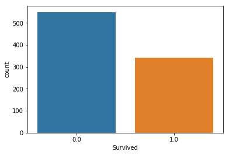


#### 死亡與生存的比例是6:4


```python
sns.countplot(data['Pclass'], hue=data['Survived'])
```


    <matplotlib.axes._subplots.AxesSubplot at 0x1f3e3ba9470>


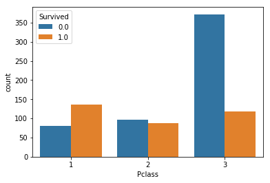


#### 可以發現生存率由大到小排序為 1艙等 > 2艙等 > 3艙等


```python
sns.countplot(data['Sex'], hue=data['Survived'])
```


    <matplotlib.axes._subplots.AxesSubplot at 0x1f3e3c244e0>


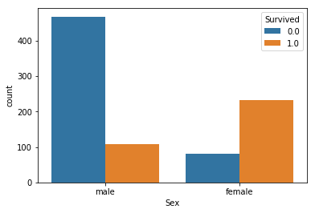


#### 發現女生生存率相當高，由此推測在逃難的時候，優先讓女生以及小孩先搭船。


```python
sns.countplot(data['Embarked'], hue=data['Survived'])
```


    <matplotlib.axes._subplots.AxesSubplot at 0x1f3e3c45978>


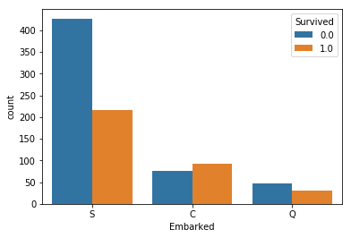


#### 發現S港口出發的死亡率最高，原因可能是S城市出發的人買的票價都比較便宜


```python
g = sns.FacetGrid(data, col='Survived')
g.map(sns.distplot, 'Age', kde=False)
```

    C:\Users\owner\AppData\Local\conda\conda\envs\tensorflow\lib\site-packages\matplotlib\axes\_axes.py:6462: UserWarning: The 'normed' kwarg is deprecated, and has been replaced by the 'density' kwarg.
      warnings.warn("The 'normed' kwarg is deprecated, and has been "
    


    <seaborn.axisgrid.FacetGrid at 0x2876c0d4e80>


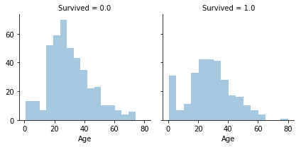


#### 發現年齡小的存活比例高出許多，呼應前面優先讓小孩搭船的推測。

# 出現問題
```
C:\Users\owner\AppData\Local\conda\conda\envs\tensorflow\lib\site-packages\matplotlib\axes\_axes.py:6462: UserWarning: The 'normed' kwarg is deprecated, and has been replaced by the 'density' kwarg.
warnings.warn("The 'normed' kwarg is deprecated, and has been "
```
## 解決方法
---
#### 因'normed'已被棄用，所以須修改[distributions.py](https://github.com/mwaskom/seaborn/blob/master/seaborn/distributions.py)檔案(直接下載取代原本檔案)
##### windows路徑為 
```
C:\Users\使用者\AppData\Local\conda\conda\pkgs\seaborn-0.8.1-py35hc73483e_0\Lib\site-packages\seaborn\distributions.py
```
### distributions.py 內容
```
"""Plotting functions for visualizing distributions."""
from __future__ import division
import numpy as np
from scipy import stats
import pandas as pd
import matplotlib as mpl
import matplotlib.pyplot as plt
import matplotlib.transforms as tx
from matplotlib.collections import LineCollection
import warnings
from distutils.version import LooseVersion

from six import string_types

try:
    import statsmodels.nonparametric.api as smnp
    _has_statsmodels = True
except ImportError:
    _has_statsmodels = False

from .utils import iqr, _kde_support
from .palettes import color_palette, light_palette, dark_palette, blend_palette


__all__ = ["distplot", "kdeplot", "rugplot"]


def _freedman_diaconis_bins(a):
    """Calculate number of hist bins using Freedman-Diaconis rule."""
    # From https://stats.stackexchange.com/questions/798/
    a = np.asarray(a)
    if len(a) < 2:
        return 1
    h = 2 * iqr(a) / (len(a) ** (1 / 3))
    # fall back to sqrt(a) bins if iqr is 0
    if h == 0:
        return int(np.sqrt(a.size))
    else:
        return int(np.ceil((a.max() - a.min()) / h))


def distplot(a, bins=None, hist=True, kde=True, rug=False, fit=None,
             hist_kws=None, kde_kws=None, rug_kws=None, fit_kws=None,
             color=None, vertical=False, norm_hist=False, axlabel=None,
             label=None, ax=None):
    """Flexibly plot a univariate distribution of observations.
    This function combines the matplotlib ``hist`` function (with automatic
    calculation of a good default bin size) with the seaborn :func:`kdeplot`
    and :func:`rugplot` functions. It can also fit ``scipy.stats``
    distributions and plot the estimated PDF over the data.
    Parameters
    ----------
    a : Series, 1d-array, or list.
        Observed data. If this is a Series object with a ``name`` attribute,
        the name will be used to label the data axis.
    bins : argument for matplotlib hist(), or None, optional
        Specification of hist bins, or None to use Freedman-Diaconis rule.
    hist : bool, optional
        Whether to plot a (normed) histogram.
    kde : bool, optional
        Whether to plot a gaussian kernel density estimate.
    rug : bool, optional
        Whether to draw a rugplot on the support axis.
    fit : random variable object, optional
        An object with `fit` method, returning a tuple that can be passed to a
        `pdf` method a positional arguments following an grid of values to
        evaluate the pdf on.
    {hist, kde, rug, fit}_kws : dictionaries, optional
        Keyword arguments for underlying plotting functions.
    color : matplotlib color, optional
        Color to plot everything but the fitted curve in.
    vertical : bool, optional
        If True, observed values are on y-axis.
    norm_hist : bool, optional
        If True, the histogram height shows a density rather than a count.
        This is implied if a KDE or fitted density is plotted.
    axlabel : string, False, or None, optional
        Name for the support axis label. If None, will try to get it
        from a.namel if False, do not set a label.
    label : string, optional
        Legend label for the relevent component of the plot
    ax : matplotlib axis, optional
        if provided, plot on this axis
    Returns
    -------
    ax : matplotlib Axes
        Returns the Axes object with the plot for further tweaking.
    See Also
    --------
    kdeplot : Show a univariate or bivariate distribution with a kernel
              density estimate.
    rugplot : Draw small vertical lines to show each observation in a
              distribution.
    Examples
    --------
    Show a default plot with a kernel density estimate and histogram with bin
    size determined automatically with a reference rule:
    .. plot::
        :context: close-figs
        >>> import seaborn as sns, numpy as np
        >>> sns.set(); np.random.seed(0)
        >>> x = np.random.randn(100)
        >>> ax = sns.distplot(x)
    Use Pandas objects to get an informative axis label:
    .. plot::
        :context: close-figs
        >>> import pandas as pd
        >>> x = pd.Series(x, name="x variable")
        >>> ax = sns.distplot(x)
    Plot the distribution with a kernel density estimate and rug plot:
    .. plot::
        :context: close-figs
        >>> ax = sns.distplot(x, rug=True, hist=False)
    Plot the distribution with a histogram and maximum likelihood gaussian
    distribution fit:
    .. plot::
        :context: close-figs
        >>> from scipy.stats import norm
        >>> ax = sns.distplot(x, fit=norm, kde=False)
    Plot the distribution on the vertical axis:
    .. plot::
        :context: close-figs
        >>> ax = sns.distplot(x, vertical=True)
    Change the color of all the plot elements:
    .. plot::
        :context: close-figs
        >>> sns.set_color_codes()
        >>> ax = sns.distplot(x, color="y")
    Pass specific parameters to the underlying plot functions:
    .. plot::
        :context: close-figs
        >>> ax = sns.distplot(x, rug=True, rug_kws={"color": "g"},
        ...                   kde_kws={"color": "k", "lw": 3, "label": "KDE"},
        ...                   hist_kws={"histtype": "step", "linewidth": 3,
        ...                             "alpha": 1, "color": "g"})
    """
    if ax is None:
        ax = plt.gca()

    # Intelligently label the support axis
    label_ax = bool(axlabel)
    if axlabel is None and hasattr(a, "name"):
        axlabel = a.name
        if axlabel is not None:
            label_ax = True

    # Make a a 1-d array
    a = np.asarray(a)
    if a.ndim > 1:
        a = a.squeeze()

    # Decide if the hist is normed
    norm_hist = norm_hist or kde or (fit is not None)

    # Handle dictionary defaults
    if hist_kws is None:
        hist_kws = dict()
    if kde_kws is None:
        kde_kws = dict()
    if rug_kws is None:
        rug_kws = dict()
    if fit_kws is None:
        fit_kws = dict()

    # Get the color from the current color cycle
    if color is None:
        if vertical:
            line, = ax.plot(0, a.mean())
        else:
            line, = ax.plot(a.mean(), 0)
        color = line.get_color()
        line.remove()

    # Plug the label into the right kwarg dictionary
    if label is not None:
        if hist:
            hist_kws["label"] = label
        elif kde:
            kde_kws["label"] = label
        elif rug:
            rug_kws["label"] = label
        elif fit:
            fit_kws["label"] = label

    if hist:
        if bins is None:
            bins = min(_freedman_diaconis_bins(a), 50)
        hist_kws.setdefault("alpha", 0.4)
        if LooseVersion(mpl.__version__) < LooseVersion("2.2"):
            hist_kws.setdefault("normed", norm_hist)
        else:
            hist_kws.setdefault("density", norm_hist)

        orientation = "horizontal" if vertical else "vertical"
        hist_color = hist_kws.pop("color", color)
        ax.hist(a, bins, orientation=orientation,
                color=hist_color, **hist_kws)
        if hist_color != color:
            hist_kws["color"] = hist_color

    if kde:
        kde_color = kde_kws.pop("color", color)
        kdeplot(a, vertical=vertical, ax=ax, color=kde_color, **kde_kws)
        if kde_color != color:
            kde_kws["color"] = kde_color

    if rug:
        rug_color = rug_kws.pop("color", color)
        axis = "y" if vertical else "x"
        rugplot(a, axis=axis, ax=ax, color=rug_color, **rug_kws)
        if rug_color != color:
            rug_kws["color"] = rug_color

    if fit is not None:

        def pdf(x):
            return fit.pdf(x, *params)

        fit_color = fit_kws.pop("color", "#282828")
        gridsize = fit_kws.pop("gridsize", 200)
        cut = fit_kws.pop("cut", 3)
        clip = fit_kws.pop("clip", (-np.inf, np.inf))
        bw = stats.gaussian_kde(a).scotts_factor() * a.std(ddof=1)
        x = _kde_support(a, bw, gridsize, cut, clip)
        params = fit.fit(a)
        y = pdf(x)
        if vertical:
            x, y = y, x
        ax.plot(x, y, color=fit_color, **fit_kws)
        if fit_color != "#282828":
            fit_kws["color"] = fit_color

    if label_ax:
        if vertical:
            ax.set_ylabel(axlabel)
        else:
            ax.set_xlabel(axlabel)

    return ax


def _univariate_kdeplot(data, shade, vertical, kernel, bw, gridsize, cut,
                        clip, legend, ax, cumulative=False, **kwargs):
    """Plot a univariate kernel density estimate on one of the axes."""

    # Sort out the clipping
    if clip is None:
        clip = (-np.inf, np.inf)

    # Calculate the KDE
    if _has_statsmodels:
        # Prefer using statsmodels for kernel flexibility
        x, y = _statsmodels_univariate_kde(data, kernel, bw,
                                           gridsize, cut, clip,
                                           cumulative=cumulative)
    else:
        # Fall back to scipy if missing statsmodels
        if kernel != "gau":
            kernel = "gau"
            msg = "Kernel other than `gau` requires statsmodels."
            warnings.warn(msg, UserWarning)
        if cumulative:
            raise ImportError("Cumulative distributions are currently"
                              "only implemented in statsmodels."
                              "Please install statsmodels.")
        x, y = _scipy_univariate_kde(data, bw, gridsize, cut, clip)

    # Make sure the density is nonnegative
    y = np.amax(np.c_[np.zeros_like(y), y], axis=1)

    # Flip the data if the plot should be on the y axis
    if vertical:
        x, y = y, x

    # Check if a label was specified in the call
    label = kwargs.pop("label", None)

    # Otherwise check if the data object has a name
    if label is None and hasattr(data, "name"):
        label = data.name

    # Decide if we're going to add a legend
    legend = label is not None and legend
    label = "_nolegend_" if label is None else label

    # Use the active color cycle to find the plot color
    facecolor = kwargs.pop("facecolor", None)
    line, = ax.plot(x, y, **kwargs)
    color = line.get_color()
    line.remove()
    kwargs.pop("color", None)
    facecolor = color if facecolor is None else facecolor

    # Draw the KDE plot and, optionally, shade
    ax.plot(x, y, color=color, label=label, **kwargs)
    shade_kws = dict(
        facecolor=facecolor,
        alpha=kwargs.get("alpha", 0.25),
        clip_on=kwargs.get("clip_on", True),
        zorder=kwargs.get("zorder", 1),
        )
    if shade:
        if vertical:
            ax.fill_betweenx(y, 0, x, **shade_kws)
        else:
            ax.fill_between(x, 0, y, **shade_kws)

    # Set the density axis minimum to 0
    if vertical:
        ax.set_xlim(0, auto=None)
    else:
        ax.set_ylim(0, auto=None)

    # Draw the legend here
    handles, labels = ax.get_legend_handles_labels()
    if legend and handles:
        ax.legend(loc="best")

    return ax


def _statsmodels_univariate_kde(data, kernel, bw, gridsize, cut, clip,
                                cumulative=False):
    """Compute a univariate kernel density estimate using statsmodels."""
    fft = kernel == "gau"
    kde = smnp.KDEUnivariate(data)
    kde.fit(kernel, bw, fft, gridsize=gridsize, cut=cut, clip=clip)
    if cumulative:
        grid, y = kde.support, kde.cdf
    else:
        grid, y = kde.support, kde.density
    return grid, y


def _scipy_univariate_kde(data, bw, gridsize, cut, clip):
    """Compute a univariate kernel density estimate using scipy."""
    try:
        kde = stats.gaussian_kde(data, bw_method=bw)
    except TypeError:
        kde = stats.gaussian_kde(data)
        if bw != "scott":  # scipy default
            msg = ("Ignoring bandwidth choice, "
                   "please upgrade scipy to use a different bandwidth.")
            warnings.warn(msg, UserWarning)
    if isinstance(bw, string_types):
        bw = "scotts" if bw == "scott" else bw
        bw = getattr(kde, "%s_factor" % bw)() * np.std(data)
    grid = _kde_support(data, bw, gridsize, cut, clip)
    y = kde(grid)
    return grid, y


def _bivariate_kdeplot(x, y, filled, fill_lowest,
                       kernel, bw, gridsize, cut, clip,
                       axlabel, cbar, cbar_ax, cbar_kws, ax, **kwargs):
    """Plot a joint KDE estimate as a bivariate contour plot."""
    # Determine the clipping
    if clip is None:
        clip = [(-np.inf, np.inf), (-np.inf, np.inf)]
    elif np.ndim(clip) == 1:
        clip = [clip, clip]

    # Calculate the KDE
    if _has_statsmodels:
        xx, yy, z = _statsmodels_bivariate_kde(x, y, bw, gridsize, cut, clip)
    else:
        xx, yy, z = _scipy_bivariate_kde(x, y, bw, gridsize, cut, clip)

    # Plot the contours
    n_levels = kwargs.pop("n_levels", 10)

    scout, = ax.plot([], [])
    default_color = scout.get_color()
    scout.remove()

    color = kwargs.pop("color", default_color)
    cmap = kwargs.pop("cmap", None)
    if cmap is None:
        if filled:
            cmap = light_palette(color, as_cmap=True)
        else:
            cmap = dark_palette(color, as_cmap=True)
    if isinstance(cmap, string_types):
        if cmap.endswith("_d"):
            pal = ["#333333"]
            pal.extend(color_palette(cmap.replace("_d", "_r"), 2))
            cmap = blend_palette(pal, as_cmap=True)
        else:
            cmap = mpl.cm.get_cmap(cmap)

    label = kwargs.pop("label", None)

    kwargs["cmap"] = cmap
    contour_func = ax.contourf if filled else ax.contour
    cset = contour_func(xx, yy, z, n_levels, **kwargs)
    if filled and not fill_lowest:
        cset.collections[0].set_alpha(0)
    kwargs["n_levels"] = n_levels

    if cbar:
        cbar_kws = {} if cbar_kws is None else cbar_kws
        ax.figure.colorbar(cset, cbar_ax, ax, **cbar_kws)

    # Label the axes
    if hasattr(x, "name") and axlabel:
        ax.set_xlabel(x.name)
    if hasattr(y, "name") and axlabel:
        ax.set_ylabel(y.name)

    if label is not None:
        legend_color = cmap(.95) if color is None else color
        if filled:
            ax.fill_between([], [], color=legend_color, label=label)
        else:
            ax.plot([], [], color=legend_color, label=label)

    return ax


def _statsmodels_bivariate_kde(x, y, bw, gridsize, cut, clip):
    """Compute a bivariate kde using statsmodels."""
    if isinstance(bw, string_types):
        bw_func = getattr(smnp.bandwidths, "bw_" + bw)
        x_bw = bw_func(x)
        y_bw = bw_func(y)
        bw = [x_bw, y_bw]
    elif np.isscalar(bw):
        bw = [bw, bw]

    if isinstance(x, pd.Series):
        x = x.values
    if isinstance(y, pd.Series):
        y = y.values

    kde = smnp.KDEMultivariate([x, y], "cc", bw)
    x_support = _kde_support(x, kde.bw[0], gridsize, cut, clip[0])
    y_support = _kde_support(y, kde.bw[1], gridsize, cut, clip[1])
    xx, yy = np.meshgrid(x_support, y_support)
    z = kde.pdf([xx.ravel(), yy.ravel()]).reshape(xx.shape)
    return xx, yy, z


def _scipy_bivariate_kde(x, y, bw, gridsize, cut, clip):
    """Compute a bivariate kde using scipy."""
    data = np.c_[x, y]
    kde = stats.gaussian_kde(data.T, bw_method=bw)
    data_std = data.std(axis=0, ddof=1)
    if isinstance(bw, string_types):
        bw = "scotts" if bw == "scott" else bw
        bw_x = getattr(kde, "%s_factor" % bw)() * data_std[0]
        bw_y = getattr(kde, "%s_factor" % bw)() * data_std[1]
    elif np.isscalar(bw):
        bw_x, bw_y = bw, bw
    else:
        msg = ("Cannot specify a different bandwidth for each dimension "
               "with the scipy backend. You should install statsmodels.")
        raise ValueError(msg)
    x_support = _kde_support(data[:, 0], bw_x, gridsize, cut, clip[0])
    y_support = _kde_support(data[:, 1], bw_y, gridsize, cut, clip[1])
    xx, yy = np.meshgrid(x_support, y_support)
    z = kde([xx.ravel(), yy.ravel()]).reshape(xx.shape)
    return xx, yy, z


def kdeplot(data, data2=None, shade=False, vertical=False, kernel="gau",
            bw="scott", gridsize=100, cut=3, clip=None, legend=True,
            cumulative=False, shade_lowest=True, cbar=False, cbar_ax=None,
            cbar_kws=None, ax=None, **kwargs):
    """Fit and plot a univariate or bivariate kernel density estimate.
    Parameters
    ----------
    data : 1d array-like
        Input data.
    data2: 1d array-like, optional
        Second input data. If present, a bivariate KDE will be estimated.
    shade : bool, optional
        If True, shade in the area under the KDE curve (or draw with filled
        contours when data is bivariate).
    vertical : bool, optional
        If True, density is on x-axis.
    kernel : {'gau' | 'cos' | 'biw' | 'epa' | 'tri' | 'triw' }, optional
        Code for shape of kernel to fit with. Bivariate KDE can only use
        gaussian kernel.
    bw : {'scott' | 'silverman' | scalar | pair of scalars }, optional
        Name of reference method to determine kernel size, scalar factor,
        or scalar for each dimension of the bivariate plot. Note that the
        underlying computational libraries have different interperetations
        for this parameter: ``statsmodels`` uses it directly, but ``scipy``
        treats it as a scaling factor for the standard deviation of the
        data.
    gridsize : int, optional
        Number of discrete points in the evaluation grid.
    cut : scalar, optional
        Draw the estimate to cut * bw from the extreme data points.
    clip : pair of scalars, or pair of pair of scalars, optional
        Lower and upper bounds for datapoints used to fit KDE. Can provide
        a pair of (low, high) bounds for bivariate plots.
    legend : bool, optional
        If True, add a legend or label the axes when possible.
    cumulative : bool, optional
        If True, draw the cumulative distribution estimated by the kde.
    shade_lowest : bool, optional
        If True, shade the lowest contour of a bivariate KDE plot. Not
        relevant when drawing a univariate plot or when ``shade=False``.
        Setting this to ``False`` can be useful when you want multiple
        densities on the same Axes.
    cbar : bool, optional
        If True and drawing a bivariate KDE plot, add a colorbar.
    cbar_ax : matplotlib axes, optional
        Existing axes to draw the colorbar onto, otherwise space is taken
        from the main axes.
    cbar_kws : dict, optional
        Keyword arguments for ``fig.colorbar()``.
    ax : matplotlib axes, optional
        Axes to plot on, otherwise uses current axes.
    kwargs : key, value pairings
        Other keyword arguments are passed to ``plt.plot()`` or
        ``plt.contour{f}`` depending on whether a univariate or bivariate
        plot is being drawn.
    Returns
    -------
    ax : matplotlib Axes
        Axes with plot.
    See Also
    --------
    distplot: Flexibly plot a univariate distribution of observations.
    jointplot: Plot a joint dataset with bivariate and marginal distributions.
    Examples
    --------
    Plot a basic univariate density:
    .. plot::
        :context: close-figs
        >>> import numpy as np; np.random.seed(10)
        >>> import seaborn as sns; sns.set(color_codes=True)
        >>> mean, cov = [0, 2], [(1, .5), (.5, 1)]
        >>> x, y = np.random.multivariate_normal(mean, cov, size=50).T
        >>> ax = sns.kdeplot(x)
    Shade under the density curve and use a different color:
    .. plot::
        :context: close-figs
        >>> ax = sns.kdeplot(x, shade=True, color="r")
    Plot a bivariate density:
    .. plot::
        :context: close-figs
        >>> ax = sns.kdeplot(x, y)
    Use filled contours:
    .. plot::
        :context: close-figs
        >>> ax = sns.kdeplot(x, y, shade=True)
    Use more contour levels and a different color palette:
    .. plot::
        :context: close-figs
        >>> ax = sns.kdeplot(x, y, n_levels=30, cmap="Purples_d")
    Use a narrower bandwith:
    .. plot::
        :context: close-figs
        >>> ax = sns.kdeplot(x, bw=.15)
    Plot the density on the vertical axis:
    .. plot::
        :context: close-figs
        >>> ax = sns.kdeplot(y, vertical=True)
    Limit the density curve within the range of the data:
    .. plot::
        :context: close-figs
        >>> ax = sns.kdeplot(x, cut=0)
    Add a colorbar for the contours:
    .. plot::
        :context: close-figs
        >>> ax = sns.kdeplot(x, y, cbar=True)
    Plot two shaded bivariate densities:
    .. plot::
        :context: close-figs
        >>> iris = sns.load_dataset("iris")
        >>> setosa = iris.loc[iris.species == "setosa"]
        >>> virginica = iris.loc[iris.species == "virginica"]
        >>> ax = sns.kdeplot(setosa.sepal_width, setosa.sepal_length,
        ...                  cmap="Reds", shade=True, shade_lowest=False)
        >>> ax = sns.kdeplot(virginica.sepal_width, virginica.sepal_length,
        ...                  cmap="Blues", shade=True, shade_lowest=False)
    """
    if ax is None:
        ax = plt.gca()

    if isinstance(data, list):
        data = np.asarray(data)

    if len(data) == 0:
        return ax

    data = data.astype(np.float64)
    if data2 is not None:
        if isinstance(data2, list):
            data2 = np.asarray(data2)
        data2 = data2.astype(np.float64)

    warn = False
    bivariate = False
    if isinstance(data, np.ndarray) and np.ndim(data) > 1:
        warn = True
        bivariate = True
        x, y = data.T
    elif isinstance(data, pd.DataFrame) and np.ndim(data) > 1:
        warn = True
        bivariate = True
        x = data.iloc[:, 0].values
        y = data.iloc[:, 1].values
    elif data2 is not None:
        bivariate = True
        x = data
        y = data2

    if warn:
        warn_msg = ("Passing a 2D dataset for a bivariate plot is deprecated "
                    "in favor of kdeplot(x, y), and it will cause an error in "
                    "future versions. Please update your code.")
        warnings.warn(warn_msg, UserWarning)

    if bivariate and cumulative:
        raise TypeError("Cumulative distribution plots are not"
                        "supported for bivariate distributions.")
    if bivariate:
        ax = _bivariate_kdeplot(x, y, shade, shade_lowest,
                                kernel, bw, gridsize, cut, clip, legend,
                                cbar, cbar_ax, cbar_kws, ax, **kwargs)
    else:
        ax = _univariate_kdeplot(data, shade, vertical, kernel, bw,
                                 gridsize, cut, clip, legend, ax,
                                 cumulative=cumulative, **kwargs)

    return ax


def rugplot(a, height=.05, axis="x", ax=None, **kwargs):
    """Plot datapoints in an array as sticks on an axis.
    Parameters
    ----------
    a : vector
        1D array of observations.
    height : scalar, optional
        Height of ticks as proportion of the axis.
    axis : {'x' | 'y'}, optional
        Axis to draw rugplot on.
    ax : matplotlib axes, optional
        Axes to draw plot into; otherwise grabs current axes.
    kwargs : key, value pairings
        Other keyword arguments are passed to ``LineCollection``.
    Returns
    -------
    ax : matplotlib axes
        The Axes object with the plot on it.
    """
    if ax is None:
        ax = plt.gca()
    a = np.asarray(a)
    vertical = kwargs.pop("vertical", axis == "y")

    alias_map = dict(linewidth="lw", linestyle="ls", color="c")
    for attr, alias in alias_map.items():
        if alias in kwargs:
            kwargs[attr] = kwargs.pop(alias)
    kwargs.setdefault("linewidth", 1)

    if vertical:
        trans = tx.blended_transform_factory(ax.transAxes, ax.transData)
        xy_pairs = np.column_stack([np.tile([0, height], len(a)),
                                    np.repeat(a, 2)])
    else:
        trans = tx.blended_transform_factory(ax.transData, ax.transAxes)
        xy_pairs = np.column_stack([np.repeat(a, 2),
                                    np.tile([0, height], len(a))])
    line_segs = xy_pairs.reshape([len(a), 2, 2])
    ax.add_collection(LineCollection(line_segs, transform=trans, **kwargs))

    ax.autoscale_view(scalex=not vertical, scaley=vertical)

    return ax
```
```python
g = sns.FacetGrid(data, col='Survived')
g.map(sns.distplot, 'Fare', kde=False)
```


    <seaborn.axisgrid.FacetGrid at 0x1d27641eeb8>


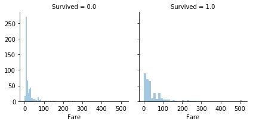


#### 發現票價低的乘客死亡率高出許多。


```python
g = sns.FacetGrid(data, col='Survived')
g.map(sns.distplot, 'Parch', kde=False)
```


    <seaborn.axisgrid.FacetGrid at 0x2612333c7f0>


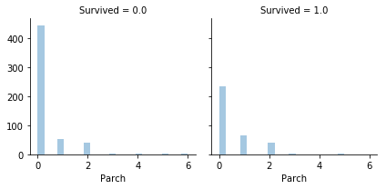


#### 發現沒有跟父母小孩一起來的生存率比起有跟父母小孩來的低


```python
g = sns.FacetGrid(data, col='Survived')
g.map(sns.distplot, 'SibSp', kde=False)
```


    <seaborn.axisgrid.FacetGrid at 0x26123355128>


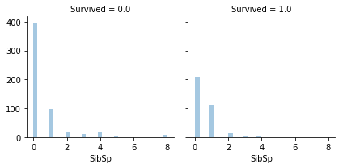


#### 發現沒有帶兄弟姊妹＋丈夫妻子一起來的生存率比起有跟兄弟姊妹＋丈夫妻子來的低


```python
data['Family_Size'] = data['Parch'] + data['SibSp']
```


```python
g = sns.FacetGrid(data, col='Survived')
g.map(sns.distplot, 'Family_Size', kde=False)
```


    <seaborn.axisgrid.FacetGrid at 0x2612333c9e8>


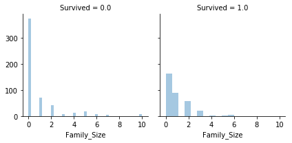


#### 經過一些反覆的測試把“父母＋小孩”加上“兄弟姊妹＋丈夫妻子”的數量變成一個新的欄位叫做家庭大小，在預測上會更為準確

# 特徵工程
---


```python
data['Title1'] = data['Name'].str.split(", ", expand=True)[1]
```


```python
data['Name'].str.split(", ", expand=True).head(3)
```


<div>
<table border="1" class="dataframe">
  <thead>
    <tr style="text-align: right;">
      <th></th>
      <th>0</th>
      <th>1</th>
    </tr>
  </thead>
  <tbody>
    <tr>
      <th>0</th>
      <td>Braund</td>
      <td>Mr. Owen Harris</td>
    </tr>
    <tr>
      <th>1</th>
      <td>Cumings</td>
      <td>Mrs. John Bradley (Florence Briggs Thayer)</td>
    </tr>
    <tr>
      <th>2</th>
      <td>Heikkinen</td>
      <td>Miss. Laina</td>
    </tr>
  </tbody>
</table>
</div>


```python
data['Title1'].head(3)
```


    0                               Mr. Owen Harris
    1    Mrs. John Bradley (Florence Briggs Thayer)
    2                                   Miss. Laina
    Name: Title1, dtype: object


```python
data['Title1'] = data['Title1'].str.split(".", expand=True)[0]
```


```python
data['Title1'].head(3)
```


    0      Mr
    1     Mrs
    2    Miss
    Name: Title1, dtype: object


```python
data['Title1'].unique()
```


    array(['Mr', 'Mrs', 'Miss', 'Master', 'Don', 'Rev', 'Dr', 'Mme', 'Ms',
           'Major', 'Lady', 'Sir', 'Mlle', 'Col', 'Capt', 'the Countess',
           'Jonkheer', 'Dona'], dtype=object)


#### 將姓名的稱謂整理後，可以發現這些人的稱謂有'Mr', 'Mrs', 'Miss', 'Master', 'Don', 'Rev', 'Dr', 'Mme', 'Ms', 'Major', 'Lady', 'Sir', 'Mlle', 'Col', 'Capt', 'the Countess','Jonkheer', 'Dona'


```python
pd.crosstab(data['Title1'],data['Sex']).T.style.background_gradient(cmap='summer_r')
```

<table id="T_19fce65c_e750_11e8_872d_1831bf9122d3" > 
<thead>    <tr> 
        <th class="index_name level0" >Title1</th> 
        <th class="col_heading level0 col0" >Capt</th> 
        <th class="col_heading level0 col1" >Col</th> 
        <th class="col_heading level0 col2" >Don</th> 
        <th class="col_heading level0 col3" >Dona</th> 
        <th class="col_heading level0 col4" >Dr</th> 
        <th class="col_heading level0 col5" >Jonkheer</th> 
        <th class="col_heading level0 col6" >Lady</th> 
        <th class="col_heading level0 col7" >Major</th> 
        <th class="col_heading level0 col8" >Master</th> 
        <th class="col_heading level0 col9" >Miss</th> 
        <th class="col_heading level0 col10" >Mlle</th> 
        <th class="col_heading level0 col11" >Mme</th> 
        <th class="col_heading level0 col12" >Mr</th> 
        <th class="col_heading level0 col13" >Mrs</th> 
        <th class="col_heading level0 col14" >Ms</th> 
        <th class="col_heading level0 col15" >Rev</th> 
        <th class="col_heading level0 col16" >Sir</th> 
        <th class="col_heading level0 col17" >the Countess</th> 
    </tr>    <tr> 
        <th class="index_name level0" >Sex</th> 
        <th class="blank" ></th> 
        <th class="blank" ></th> 
        <th class="blank" ></th> 
        <th class="blank" ></th> 
        <th class="blank" ></th> 
        <th class="blank" ></th> 
        <th class="blank" ></th> 
        <th class="blank" ></th> 
        <th class="blank" ></th> 
        <th class="blank" ></th> 
        <th class="blank" ></th> 
        <th class="blank" ></th> 
        <th class="blank" ></th> 
        <th class="blank" ></th> 
        <th class="blank" ></th> 
        <th class="blank" ></th> 
        <th class="blank" ></th> 
        <th class="blank" ></th> 
    </tr></thead> 
<tbody>    <tr> 
        <th id="T_19fce65c_e750_11e8_872d_1831bf9122d3level0_row0" class="row_heading level0 row0" >0</th> 
        <td id="T_19fce65c_e750_11e8_872d_1831bf9122d3row0_col0" class="data row0 col0" >0</td> 
        <td id="T_19fce65c_e750_11e8_872d_1831bf9122d3row0_col1" class="data row0 col1" >0</td> 
        <td id="T_19fce65c_e750_11e8_872d_1831bf9122d3row0_col2" class="data row0 col2" >0</td> 
        <td id="T_19fce65c_e750_11e8_872d_1831bf9122d3row0_col3" class="data row0 col3" >1</td> 
        <td id="T_19fce65c_e750_11e8_872d_1831bf9122d3row0_col4" class="data row0 col4" >1</td> 
        <td id="T_19fce65c_e750_11e8_872d_1831bf9122d3row0_col5" class="data row0 col5" >0</td> 
        <td id="T_19fce65c_e750_11e8_872d_1831bf9122d3row0_col6" class="data row0 col6" >1</td> 
        <td id="T_19fce65c_e750_11e8_872d_1831bf9122d3row0_col7" class="data row0 col7" >0</td> 
        <td id="T_19fce65c_e750_11e8_872d_1831bf9122d3row0_col8" class="data row0 col8" >0</td> 
        <td id="T_19fce65c_e750_11e8_872d_1831bf9122d3row0_col9" class="data row0 col9" >260</td> 
        <td id="T_19fce65c_e750_11e8_872d_1831bf9122d3row0_col10" class="data row0 col10" >2</td> 
        <td id="T_19fce65c_e750_11e8_872d_1831bf9122d3row0_col11" class="data row0 col11" >1</td> 
        <td id="T_19fce65c_e750_11e8_872d_1831bf9122d3row0_col12" class="data row0 col12" >0</td> 
        <td id="T_19fce65c_e750_11e8_872d_1831bf9122d3row0_col13" class="data row0 col13" >197</td> 
        <td id="T_19fce65c_e750_11e8_872d_1831bf9122d3row0_col14" class="data row0 col14" >2</td> 
        <td id="T_19fce65c_e750_11e8_872d_1831bf9122d3row0_col15" class="data row0 col15" >0</td> 
        <td id="T_19fce65c_e750_11e8_872d_1831bf9122d3row0_col16" class="data row0 col16" >0</td> 
        <td id="T_19fce65c_e750_11e8_872d_1831bf9122d3row0_col17" class="data row0 col17" >1</td> 
    </tr>    <tr> 
        <th id="T_19fce65c_e750_11e8_872d_1831bf9122d3level0_row1" class="row_heading level0 row1" >1</th> 
        <td id="T_19fce65c_e750_11e8_872d_1831bf9122d3row1_col0" class="data row1 col0" >1</td> 
        <td id="T_19fce65c_e750_11e8_872d_1831bf9122d3row1_col1" class="data row1 col1" >4</td> 
        <td id="T_19fce65c_e750_11e8_872d_1831bf9122d3row1_col2" class="data row1 col2" >1</td> 
        <td id="T_19fce65c_e750_11e8_872d_1831bf9122d3row1_col3" class="data row1 col3" >0</td> 
        <td id="T_19fce65c_e750_11e8_872d_1831bf9122d3row1_col4" class="data row1 col4" >7</td> 
        <td id="T_19fce65c_e750_11e8_872d_1831bf9122d3row1_col5" class="data row1 col5" >1</td> 
        <td id="T_19fce65c_e750_11e8_872d_1831bf9122d3row1_col6" class="data row1 col6" >0</td> 
        <td id="T_19fce65c_e750_11e8_872d_1831bf9122d3row1_col7" class="data row1 col7" >2</td> 
        <td id="T_19fce65c_e750_11e8_872d_1831bf9122d3row1_col8" class="data row1 col8" >61</td> 
        <td id="T_19fce65c_e750_11e8_872d_1831bf9122d3row1_col9" class="data row1 col9" >0</td> 
        <td id="T_19fce65c_e750_11e8_872d_1831bf9122d3row1_col10" class="data row1 col10" >0</td> 
        <td id="T_19fce65c_e750_11e8_872d_1831bf9122d3row1_col11" class="data row1 col11" >0</td> 
        <td id="T_19fce65c_e750_11e8_872d_1831bf9122d3row1_col12" class="data row1 col12" >757</td> 
        <td id="T_19fce65c_e750_11e8_872d_1831bf9122d3row1_col13" class="data row1 col13" >0</td> 
        <td id="T_19fce65c_e750_11e8_872d_1831bf9122d3row1_col14" class="data row1 col14" >0</td> 
        <td id="T_19fce65c_e750_11e8_872d_1831bf9122d3row1_col15" class="data row1 col15" >8</td> 
        <td id="T_19fce65c_e750_11e8_872d_1831bf9122d3row1_col16" class="data row1 col16" >1</td> 
        <td id="T_19fce65c_e750_11e8_872d_1831bf9122d3row1_col17" class="data row1 col17" >0</td> 
    </tr></tbody> 
</table> 


```python
pd.crosstab(data['Title1'],data['Survived']).T.style.background_gradient(cmap='summer_r')
```
 
<table id="T_1a13c4dc_e750_11e8_93f4_1831bf9122d3" > 
<thead>    <tr> 
        <th class="index_name level0" >Title1</th> 
        <th class="col_heading level0 col0" >Capt</th> 
        <th class="col_heading level0 col1" >Col</th> 
        <th class="col_heading level0 col2" >Don</th> 
        <th class="col_heading level0 col3" >Dr</th> 
        <th class="col_heading level0 col4" >Jonkheer</th> 
        <th class="col_heading level0 col5" >Lady</th> 
        <th class="col_heading level0 col6" >Major</th> 
        <th class="col_heading level0 col7" >Master</th> 
        <th class="col_heading level0 col8" >Miss</th> 
        <th class="col_heading level0 col9" >Mlle</th> 
        <th class="col_heading level0 col10" >Mme</th> 
        <th class="col_heading level0 col11" >Mr</th> 
        <th class="col_heading level0 col12" >Mrs</th> 
        <th class="col_heading level0 col13" >Ms</th> 
        <th class="col_heading level0 col14" >Rev</th> 
        <th class="col_heading level0 col15" >Sir</th> 
        <th class="col_heading level0 col16" >the Countess</th> 
    </tr>    <tr> 
        <th class="index_name level0" >Survived</th> 
        <th class="blank" ></th> 
        <th class="blank" ></th> 
        <th class="blank" ></th> 
        <th class="blank" ></th> 
        <th class="blank" ></th> 
        <th class="blank" ></th> 
        <th class="blank" ></th> 
        <th class="blank" ></th> 
        <th class="blank" ></th> 
        <th class="blank" ></th> 
        <th class="blank" ></th> 
        <th class="blank" ></th> 
        <th class="blank" ></th> 
        <th class="blank" ></th> 
        <th class="blank" ></th> 
        <th class="blank" ></th> 
        <th class="blank" ></th> 
    </tr></thead> 
<tbody>    <tr> 
        <th id="T_1a13c4dc_e750_11e8_93f4_1831bf9122d3level0_row0" class="row_heading level0 row0" >0.0</th> 
        <td id="T_1a13c4dc_e750_11e8_93f4_1831bf9122d3row0_col0" class="data row0 col0" >1</td> 
        <td id="T_1a13c4dc_e750_11e8_93f4_1831bf9122d3row0_col1" class="data row0 col1" >1</td> 
        <td id="T_1a13c4dc_e750_11e8_93f4_1831bf9122d3row0_col2" class="data row0 col2" >1</td> 
        <td id="T_1a13c4dc_e750_11e8_93f4_1831bf9122d3row0_col3" class="data row0 col3" >4</td> 
        <td id="T_1a13c4dc_e750_11e8_93f4_1831bf9122d3row0_col4" class="data row0 col4" >1</td> 
        <td id="T_1a13c4dc_e750_11e8_93f4_1831bf9122d3row0_col5" class="data row0 col5" >0</td> 
        <td id="T_1a13c4dc_e750_11e8_93f4_1831bf9122d3row0_col6" class="data row0 col6" >1</td> 
        <td id="T_1a13c4dc_e750_11e8_93f4_1831bf9122d3row0_col7" class="data row0 col7" >17</td> 
        <td id="T_1a13c4dc_e750_11e8_93f4_1831bf9122d3row0_col8" class="data row0 col8" >55</td> 
        <td id="T_1a13c4dc_e750_11e8_93f4_1831bf9122d3row0_col9" class="data row0 col9" >0</td> 
        <td id="T_1a13c4dc_e750_11e8_93f4_1831bf9122d3row0_col10" class="data row0 col10" >0</td> 
        <td id="T_1a13c4dc_e750_11e8_93f4_1831bf9122d3row0_col11" class="data row0 col11" >436</td> 
        <td id="T_1a13c4dc_e750_11e8_93f4_1831bf9122d3row0_col12" class="data row0 col12" >26</td> 
        <td id="T_1a13c4dc_e750_11e8_93f4_1831bf9122d3row0_col13" class="data row0 col13" >0</td> 
        <td id="T_1a13c4dc_e750_11e8_93f4_1831bf9122d3row0_col14" class="data row0 col14" >6</td> 
        <td id="T_1a13c4dc_e750_11e8_93f4_1831bf9122d3row0_col15" class="data row0 col15" >0</td> 
        <td id="T_1a13c4dc_e750_11e8_93f4_1831bf9122d3row0_col16" class="data row0 col16" >0</td> 
    </tr>    <tr> 
        <th id="T_1a13c4dc_e750_11e8_93f4_1831bf9122d3level0_row1" class="row_heading level0 row1" >1.0</th> 
        <td id="T_1a13c4dc_e750_11e8_93f4_1831bf9122d3row1_col0" class="data row1 col0" >0</td> 
        <td id="T_1a13c4dc_e750_11e8_93f4_1831bf9122d3row1_col1" class="data row1 col1" >1</td> 
        <td id="T_1a13c4dc_e750_11e8_93f4_1831bf9122d3row1_col2" class="data row1 col2" >0</td> 
        <td id="T_1a13c4dc_e750_11e8_93f4_1831bf9122d3row1_col3" class="data row1 col3" >3</td> 
        <td id="T_1a13c4dc_e750_11e8_93f4_1831bf9122d3row1_col4" class="data row1 col4" >0</td> 
        <td id="T_1a13c4dc_e750_11e8_93f4_1831bf9122d3row1_col5" class="data row1 col5" >1</td> 
        <td id="T_1a13c4dc_e750_11e8_93f4_1831bf9122d3row1_col6" class="data row1 col6" >1</td> 
        <td id="T_1a13c4dc_e750_11e8_93f4_1831bf9122d3row1_col7" class="data row1 col7" >23</td> 
        <td id="T_1a13c4dc_e750_11e8_93f4_1831bf9122d3row1_col8" class="data row1 col8" >127</td> 
        <td id="T_1a13c4dc_e750_11e8_93f4_1831bf9122d3row1_col9" class="data row1 col9" >2</td> 
        <td id="T_1a13c4dc_e750_11e8_93f4_1831bf9122d3row1_col10" class="data row1 col10" >1</td> 
        <td id="T_1a13c4dc_e750_11e8_93f4_1831bf9122d3row1_col11" class="data row1 col11" >81</td> 
        <td id="T_1a13c4dc_e750_11e8_93f4_1831bf9122d3row1_col12" class="data row1 col12" >99</td> 
        <td id="T_1a13c4dc_e750_11e8_93f4_1831bf9122d3row1_col13" class="data row1 col13" >1</td> 
        <td id="T_1a13c4dc_e750_11e8_93f4_1831bf9122d3row1_col14" class="data row1 col14" >0</td> 
        <td id="T_1a13c4dc_e750_11e8_93f4_1831bf9122d3row1_col15" class="data row1 col15" >1</td> 
        <td id="T_1a13c4dc_e750_11e8_93f4_1831bf9122d3row1_col16" class="data row1 col16" >1</td> 
    </tr></tbody> 
</table> 


```python
data.groupby(['Title1'])['Age'].mean()
```


    Title1
    Capt            70.000000
    Col             54.000000
    Don             40.000000
    Dona            39.000000
    Dr              43.571429
    Jonkheer        38.000000
    Lady            48.000000
    Major           48.500000
    Master           5.482642
    Miss            21.774238
    Mlle            24.000000
    Mme             24.000000
    Mr              32.252151
    Mrs             36.994118
    Ms              28.000000
    Rev             41.250000
    Sir             49.000000
    the Countess    33.000000
    Name: Age, dtype: float64


#### 將稱謂對性別、生存率、以及年齡做分析，發現像是Master平均年齡只有五歲，非常小，都是男生，並且生存機率有大約6成。

# 把稱謂做合併。
---


```python
data['Title2'] = data['Title1'].replace(['Mlle','Mme','Ms','Dr','Major','Lady','the Countess','Jonkheer','Col','Rev','Capt','Sir','Don','Dona'],
         ['Miss','Mrs','Miss','Mr','Mr','Mrs','Mrs','Mr','Mr','Mr','Mr','Mr','Mr','Mrs'])
```

##### 將'Mlle'取代為'Miss'，'Mme'取代為'Mrs'，'Ms'取代為'Miss'......以此類推


```python
data['Title2'].unique()
```


    array(['Mr', 'Mrs', 'Miss', 'Master'], dtype=object)


```python
data.groupby('Title2')['Age'].mean()
```


    Title2
    Master     5.482642
    Miss      21.824366
    Mr        32.811056
    Mrs       36.971264
    Name: Age, dtype: float64


```python
pd.crosstab(data['Title2'],data['Sex']).T.style.background_gradient(cmap='summer_r') 
```

<table id="T_1ad2671c_e750_11e8_9c35_1831bf9122d3" > 
<thead>    <tr> 
        <th class="index_name level0" >Title2</th> 
        <th class="col_heading level0 col0" >Master</th> 
        <th class="col_heading level0 col1" >Miss</th> 
        <th class="col_heading level0 col2" >Mr</th> 
        <th class="col_heading level0 col3" >Mrs</th> 
    </tr>    <tr> 
        <th class="index_name level0" >Sex</th> 
        <th class="blank" ></th> 
        <th class="blank" ></th> 
        <th class="blank" ></th> 
        <th class="blank" ></th> 
    </tr></thead> 
<tbody>    <tr> 
        <th id="T_1ad2671c_e750_11e8_9c35_1831bf9122d3level0_row0" class="row_heading level0 row0" >0</th> 
        <td id="T_1ad2671c_e750_11e8_9c35_1831bf9122d3row0_col0" class="data row0 col0" >0</td> 
        <td id="T_1ad2671c_e750_11e8_9c35_1831bf9122d3row0_col1" class="data row0 col1" >264</td> 
        <td id="T_1ad2671c_e750_11e8_9c35_1831bf9122d3row0_col2" class="data row0 col2" >1</td> 
        <td id="T_1ad2671c_e750_11e8_9c35_1831bf9122d3row0_col3" class="data row0 col3" >201</td> 
    </tr>    <tr> 
        <th id="T_1ad2671c_e750_11e8_9c35_1831bf9122d3level0_row1" class="row_heading level0 row1" >1</th> 
        <td id="T_1ad2671c_e750_11e8_9c35_1831bf9122d3row1_col0" class="data row1 col0" >61</td> 
        <td id="T_1ad2671c_e750_11e8_9c35_1831bf9122d3row1_col1" class="data row1 col1" >0</td> 
        <td id="T_1ad2671c_e750_11e8_9c35_1831bf9122d3row1_col2" class="data row1 col2" >782</td> 
        <td id="T_1ad2671c_e750_11e8_9c35_1831bf9122d3row1_col3" class="data row1 col3" >0</td> 
    </tr></tbody> 
</table> 


```python
pd.crosstab(data['Title2'],data['Survived']).T.style.background_gradient(cmap='summer_r') 
```

<table id="T_1ae93e3e_e750_11e8_a592_1831bf9122d3" > 
<thead>    <tr> 
        <th class="index_name level0" >Title2</th> 
        <th class="col_heading level0 col0" >Master</th> 
        <th class="col_heading level0 col1" >Miss</th> 
        <th class="col_heading level0 col2" >Mr</th> 
        <th class="col_heading level0 col3" >Mrs</th> 
    </tr>    <tr> 
        <th class="index_name level0" >Survived</th> 
        <th class="blank" ></th> 
        <th class="blank" ></th> 
        <th class="blank" ></th> 
        <th class="blank" ></th> 
    </tr></thead> 
<tbody>    <tr> 
        <th id="T_1ae93e3e_e750_11e8_a592_1831bf9122d3level0_row0" class="row_heading level0 row0" >0.0</th> 
        <td id="T_1ae93e3e_e750_11e8_a592_1831bf9122d3row0_col0" class="data row0 col0" >17</td> 
        <td id="T_1ae93e3e_e750_11e8_a592_1831bf9122d3row0_col1" class="data row0 col1" >55</td> 
        <td id="T_1ae93e3e_e750_11e8_a592_1831bf9122d3row0_col2" class="data row0 col2" >451</td> 
        <td id="T_1ae93e3e_e750_11e8_a592_1831bf9122d3row0_col3" class="data row0 col3" >26</td> 
    </tr>    <tr> 
        <th id="T_1ae93e3e_e750_11e8_a592_1831bf9122d3level0_row1" class="row_heading level0 row1" >1.0</th> 
        <td id="T_1ae93e3e_e750_11e8_a592_1831bf9122d3row1_col0" class="data row1 col0" >23</td> 
        <td id="T_1ae93e3e_e750_11e8_a592_1831bf9122d3row1_col1" class="data row1 col1" >130</td> 
        <td id="T_1ae93e3e_e750_11e8_a592_1831bf9122d3row1_col2" class="data row1 col2" >87</td> 
        <td id="T_1ae93e3e_e750_11e8_a592_1831bf9122d3row1_col3" class="data row1 col3" >102</td> 
    </tr></tbody> 
</table> 


# 查看車票資訊
---


```python
data['Ticket'].unique()
```


    array(['A/5 21171', 'PC 17599', 'STON/O2. 3101282', '113803', '373450',
           '330877', '17463', '349909', '347742', '237736', 'PP 9549',
           '113783', 'A/5. 2151', '347082', '350406', '248706', '382652',
           '244373', '345763', '2649', '239865', '248698', '330923', '113788',
           '347077', '2631', '19950', '330959', '349216', 'PC 17601',
           'PC 17569', '335677', 'C.A. 24579', 'PC 17604', '113789', '2677',
           'A./5. 2152', '345764', '2651', '7546', '11668', '349253',
           'SC/Paris 2123', '330958', 'S.C./A.4. 23567', '370371', '14311',
           '2662', '349237', '3101295', 'A/4. 39886', 'PC 17572', '2926',
           '113509', '19947', 'C.A. 31026', '2697', 'C.A. 34651', 'CA 2144',
           '2669', '113572', '36973', '347088', 'PC 17605', '2661',
           'C.A. 29395', 'S.P. 3464', '3101281', '315151', 'C.A. 33111',
           'S.O.C. 14879', '2680', '1601', '348123', '349208', '374746',
           '248738', '364516', '345767', '345779', '330932', '113059',
           'SO/C 14885', '3101278', 'W./C. 6608', 'SOTON/OQ 392086', '343275',
           '343276', '347466', 'W.E.P. 5734', 'C.A. 2315', '364500', '374910',
           'PC 17754', 'PC 17759', '231919', '244367', '349245', '349215',
           '35281', '7540', '3101276', '349207', '343120', '312991', '349249',
           '371110', '110465', '2665', '324669', '4136', '2627',
           'STON/O 2. 3101294', '370369', 'PC 17558', 'A4. 54510', '27267',
           '370372', 'C 17369', '2668', '347061', '349241',
           'SOTON/O.Q. 3101307', 'A/5. 3337', '228414', 'C.A. 29178',
           'SC/PARIS 2133', '11752', '7534', 'PC 17593', '2678', '347081',
           'STON/O2. 3101279', '365222', '231945', 'C.A. 33112', '350043',
           '230080', '244310', 'S.O.P. 1166', '113776', 'A.5. 11206',
           'A/5. 851', 'Fa 265302', 'PC 17597', '35851', 'SOTON/OQ 392090',
           '315037', 'CA. 2343', '371362', 'C.A. 33595', '347068', '315093',
           '363291', '113505', 'PC 17318', '111240', 'STON/O 2. 3101280',
           '17764', '350404', '4133', 'PC 17595', '250653', 'LINE',
           'SC/PARIS 2131', '230136', '315153', '113767', '370365', '111428',
           '364849', '349247', '234604', '28424', '350046', 'PC 17610',
           '368703', '4579', '370370', '248747', '345770', '3101264', '2628',
           'A/5 3540', '347054', '2699', '367231', '112277',
           'SOTON/O.Q. 3101311', 'F.C.C. 13528', 'A/5 21174', '250646',
           '367229', '35273', 'STON/O2. 3101283', '243847', '11813',
           'W/C 14208', 'SOTON/OQ 392089', '220367', '21440', '349234',
           '19943', 'PP 4348', 'SW/PP 751', 'A/5 21173', '236171', '347067',
           '237442', 'C.A. 29566', 'W./C. 6609', '26707', 'C.A. 31921',
           '28665', 'SCO/W 1585', '367230', 'W./C. 14263',
           'STON/O 2. 3101275', '2694', '19928', '347071', '250649', '11751',
           '244252', '362316', '113514', 'A/5. 3336', '370129', '2650',
           'PC 17585', '110152', 'PC 17755', '230433', '384461', '110413',
           '112059', '382649', 'C.A. 17248', '347083', 'PC 17582', 'PC 17760',
           '113798', '250644', 'PC 17596', '370375', '13502', '347073',
           '239853', 'C.A. 2673', '336439', '347464', '345778', 'A/5. 10482',
           '113056', '349239', '345774', '349206', '237798', '370373',
           '19877', '11967', 'SC/Paris 2163', '349236', '349233', 'PC 17612',
           '2693', '113781', '19988', '9234', '367226', '226593', 'A/5 2466',
           '17421', 'PC 17758', 'P/PP 3381', 'PC 17485', '11767', 'PC 17608',
           '250651', '349243', 'F.C.C. 13529', '347470', '29011', '36928',
           '16966', 'A/5 21172', '349219', '234818', '345364', '28551',
           '111361', '113043', 'PC 17611', '349225', '7598', '113784',
           '248740', '244361', '229236', '248733', '31418', '386525',
           'C.A. 37671', '315088', '7267', '113510', '2695', '2647', '345783',
           '237671', '330931', '330980', 'SC/PARIS 2167', '2691',
           'SOTON/O.Q. 3101310', 'C 7076', '110813', '2626', '14313',
           'PC 17477', '11765', '3101267', '323951', 'C 7077', '113503',
           '2648', '347069', 'PC 17757', '2653', 'STON/O 2. 3101293',
           '349227', '27849', '367655', 'SC 1748', '113760', '350034',
           '3101277', '350052', '350407', '28403', '244278', '240929',
           'STON/O 2. 3101289', '341826', '4137', '315096', '28664', '347064',
           '29106', '312992', '349222', '394140', 'STON/O 2. 3101269',
           '343095', '28220', '250652', '28228', '345773', '349254',
           'A/5. 13032', '315082', '347080', 'A/4. 34244', '2003', '250655',
           '364851', 'SOTON/O.Q. 392078', '110564', '376564', 'SC/AH 3085',
           'STON/O 2. 3101274', '13507', 'C.A. 18723', '345769', '347076',
           '230434', '65306', '33638', '113794', '2666', '113786', '65303',
           '113051', '17453', 'A/5 2817', '349240', '13509', '17464',
           'F.C.C. 13531', '371060', '19952', '364506', '111320', '234360',
           'A/S 2816', 'SOTON/O.Q. 3101306', '113792', '36209', '323592',
           '315089', 'SC/AH Basle 541', '7553', '31027', '3460', '350060',
           '3101298', '239854', 'A/5 3594', '4134', '11771', 'A.5. 18509',
           '65304', 'SOTON/OQ 3101317', '113787', 'PC 17609', 'A/4 45380',
           '36947', 'C.A. 6212', '350035', '315086', '364846', '330909',
           '4135', '26360', '111427', 'C 4001', '382651', 'SOTON/OQ 3101316',
           'PC 17473', 'PC 17603', '349209', '36967', 'C.A. 34260', '226875',
           '349242', '12749', '349252', '2624', '2700', '367232',
           'W./C. 14258', 'PC 17483', '3101296', '29104', '2641', '2690',
           '315084', '113050', 'PC 17761', '364498', '13568', 'WE/P 5735',
           '2908', '693', 'SC/PARIS 2146', '244358', '330979', '2620',
           '347085', '113807', '11755', '345572', '372622', '349251',
           '218629', 'SOTON/OQ 392082', 'SOTON/O.Q. 392087', 'A/4 48871',
           '349205', '2686', '350417', 'S.W./PP 752', '11769', 'PC 17474',
           '14312', 'A/4. 20589', '358585', '243880', '2689',
           'STON/O 2. 3101286', '237789', '13049', '3411', '237565', '13567',
           '14973', 'A./5. 3235', 'STON/O 2. 3101273', 'A/5 3902', '364848',
           'SC/AH 29037', '248727', '2664', '349214', '113796', '364511',
           '111426', '349910', '349246', '113804', 'SOTON/O.Q. 3101305',
           '370377', '364512', '220845', '31028', '2659', '11753', '350029',
           '54636', '36963', '219533', '349224', '334912', '27042', '347743',
           '13214', '112052', '237668', 'STON/O 2. 3101292', '350050',
           '349231', '13213', 'S.O./P.P. 751', 'CA. 2314', '349221', '8475',
           '330919', '365226', '349223', '29751', '2623', '5727', '349210',
           'STON/O 2. 3101285', '234686', '312993', 'A/5 3536', '19996',
           '29750', 'F.C. 12750', 'C.A. 24580', '244270', '239856', '349912',
           '342826', '4138', '330935', '6563', '349228', '350036', '24160',
           '17474', '349256', '2672', '113800', '248731', '363592', '35852',
           '348121', 'PC 17475', '36864', '350025', '223596', 'PC 17476',
           'PC 17482', '113028', '7545', '250647', '348124', '34218', '36568',
           '347062', '350048', '12233', '250643', '113806', '315094', '36866',
           '236853', 'STON/O2. 3101271', '239855', '28425', '233639',
           '349201', '349218', '16988', '376566', 'STON/O 2. 3101288',
           '250648', '113773', '335097', '29103', '392096', '345780',
           '349204', '350042', '29108', '363294', 'SOTON/O2 3101272', '2663',
           '347074', '112379', '364850', '8471', '345781', '350047',
           'S.O./P.P. 3', '2674', '29105', '347078', '383121', '36865',
           '2687', '113501', 'W./C. 6607', 'SOTON/O.Q. 3101312', '374887',
           '3101265', '12460', 'PC 17600', '349203', '28213', '17465',
           '349244', '2685', '2625', '347089', '347063', '112050', '347087',
           '248723', '3474', '28206', '364499', '112058', 'STON/O2. 3101290',
           'S.C./PARIS 2079', 'C 7075', '315098', '19972', '368323', '367228',
           '2671', '347468', '2223', 'PC 17756', '315097', '392092', '11774',
           'SOTON/O2 3101287', '2683', '315090', 'C.A. 5547', '349213',
           '347060', 'PC 17592', '392091', '113055', '2629', '350026',
           '28134', '17466', '233866', '236852', 'SC/PARIS 2149', 'PC 17590',
           '345777', '349248', '695', '345765', '2667', '349212', '349217',
           '349257', '7552', 'C.A./SOTON 34068', 'SOTON/OQ 392076', '211536',
           '112053', '111369', '370376', '330911', '363272', '240276',
           '315154', '7538', '330972', '2657', '349220', '694', '21228',
           '24065', '233734', '2692', 'STON/O2. 3101270', '2696', 'C 17368',
           'PC 17598', '2698', '113054', 'C.A. 31029', '13236', '2682',
           '342712', '315087', '345768', '113778', 'SOTON/O.Q. 3101263',
           '237249', 'STON/O 2. 3101291', 'PC 17594', '370374', '13695',
           'SC/PARIS 2168', 'SC/A.3 2861', '349230', '348122', '349232',
           '237216', '347090', '334914', 'F.C.C. 13534', '330963', '2543',
           '382653', '349211', '3101297', 'PC 17562', '359306', '11770',
           '248744', '368702', '19924', '349238', '240261', '2660', '330844',
           'A/4 31416', '364856', '347072', '345498', '376563', '13905',
           '350033', 'STON/O 2. 3101268', '347471', 'A./5. 3338', '11778',
           '365235', '347070', '330920', '383162', '3410', '248734', '237734',
           '330968', 'PC 17531', '329944', '2681', '13050', '367227',
           '392095', '368783', '350045', '211535', '342441',
           'STON/OQ. 369943', '113780', '2621', '349226', '350409', '2656',
           '248659', 'SOTON/OQ 392083', '17475', 'SC/A4 23568', '113791',
           '349255', '3701', '350405', 'S.O./P.P. 752', '347469', '110489',
           'SOTON/O.Q. 3101315', '335432', '220844', '343271', '237393',
           'PC 17591', '17770', '7548', 'S.O./P.P. 251', '2670', '2673',
           '233478', '7935', '239059', 'S.O./P.P. 2', 'A/4 48873', '28221',
           '111163', '235509', '347465', '347066', 'C.A. 31030', '65305',
           'C.A. 34050', 'F.C. 12998', '9232', '28034', 'PC 17613', '349250',
           'SOTON/O.Q. 3101308', '347091', '113038', '330924', '32302',
           'SC/PARIS 2148', '342684', 'W./C. 14266', '350053', 'PC 17606',
           '350054', '370368', '242963', '113795', '3101266', '330971',
           '350416', '2679', '250650', '112377', '3470', 'SOTON/O2 3101284',
           '13508', '7266', '345775', 'C.A. 42795', 'AQ/4 3130', '363611',
           '28404', '345501', '350410', 'C.A. 34644', '349235', '112051',
           'C.A. 49867', 'A. 2. 39186', '315095', '368573', '2676',
           'SC 14888', 'CA 31352', 'W./C. 14260', '315085', '364859',
           'A/5 21175', 'SOTON/O.Q. 3101314', '2655', 'A/5 1478', 'PC 17607',
           '382650', '2652', '345771', '349202', '113801', '347467', '347079',
           '237735', '315092', '383123', '112901', '315091', '2658',
           'LP 1588', '368364', 'AQ/3. 30631', '28004', '350408', '347075',
           '2654', '244368', '113790', 'SOTON/O.Q. 3101309', '236854',
           'PC 17580', '2684', '349229', '110469', '244360', '2675', '2622',
           'C.A. 15185', '350403', '348125', '237670', '2688', '248726',
           'F.C.C. 13540', '113044', '1222', '368402', '315083', '112378',
           'SC/PARIS 2147', '28133', '248746', '315152', '29107', '680',
           '366713', '330910', 'SC/PARIS 2159', '349911', '244346', '364858',
           'C.A. 30769', '371109', '347065', '21332', '17765',
           'SC/PARIS 2166', '28666', '334915', '365237', '347086',
           'A.5. 3236', 'SOTON/O.Q. 3101262', '359309'], dtype=object)


```python
data['Ticket_info'] = data['Ticket'].apply(lambda x : x.replace(".","").replace("/","").strip().split(' ')[0] if not x.isdigit() else 'X')
```

#### 因為相同的英文代碼可能代表的是房間的位置，後面的號碼沒有意義所以省略，如果只有號碼的票號就用X來表示


```python
data['Ticket_info'].unique()
```


    array(['A5', 'PC', 'STONO2', 'X', 'PP', 'CA', 'SCParis', 'SCA4', 'A4',
           'SP', 'SOC', 'WC', 'SOTONOQ', 'WEP', 'STONO', 'C', 'SCPARIS',
           'SOP', 'Fa', 'LINE', 'FCC', 'SWPP', 'SCOW', 'PPP', 'SC', 'SCAH',
           'AS', 'SOPP', 'FC', 'SOTONO2', 'CASOTON', 'SCA3', 'STONOQ', 'AQ4',
           'A', 'LP', 'AQ3'], dtype=object)


```python
sns.countplot(data['Ticket_info'], hue=data['Survived'])
```


    <matplotlib.axes._subplots.AxesSubplot at 0x261231a94e0>


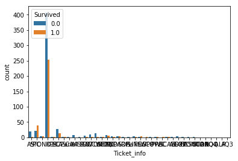


# 遺漏數填補
---


```python
data.info()
```

    <class 'pandas.core.frame.DataFrame'>
    Int64Index: 1309 entries, 0 to 417
    Data columns (total 15 columns):
    Age            1046 non-null float64
    Cabin          1309 non-null object
    Embarked       1309 non-null int8
    Fare           1309 non-null float64
    Name           1309 non-null object
    Parch          1309 non-null int64
    PassengerId    1309 non-null int64
    Pclass         1309 non-null int8
    Sex            1309 non-null int8
    SibSp          1309 non-null int64
    Survived       891 non-null float64
    Ticket         1309 non-null object
    Title1         1309 non-null object
    Title2         1309 non-null object
    Ticket_info    1309 non-null object
    dtypes: float64(3), int64(3), int8(3), object(6)
    memory usage: 176.8+ KB
    


```python
data['Embarked'] = data['Embarked'].fillna('S')
```

#### 由於Embarked只有兩筆，我們就直接補上出現次數最多的”S”。


```python
data['Fare'] = data['Fare'].fillna(data['Fare'].mean())
```

#### Fare也只有遺漏一筆，因此就直接補上平均值。


```python
data.info()
```

    <class 'pandas.core.frame.DataFrame'>
    Int64Index: 1309 entries, 0 to 417
    Data columns (total 15 columns):
    Age            1046 non-null float64
    Cabin          1309 non-null object
    Embarked       1309 non-null int8
    Fare           1309 non-null float64
    Name           1309 non-null object
    Parch          1309 non-null int64
    PassengerId    1309 non-null int64
    Pclass         1309 non-null int8
    Sex            1309 non-null int8
    SibSp          1309 non-null int64
    Survived       891 non-null float64
    Ticket         1309 non-null object
    Title1         1309 non-null object
    Title2         1309 non-null object
    Ticket_info    1309 non-null object
    dtypes: float64(3), int64(3), int8(3), object(6)
    memory usage: 176.8+ KB
    

#### 如此一來Embarked、Fare就填滿1309了


```python
data['Cabin'].head(10)
```


    0    NoCabin
    1          C
    2    NoCabin
    3          C
    4    NoCabin
    5    NoCabin
    6          E
    7    NoCabin
    8    NoCabin
    9    NoCabin
    Name: Cabin, dtype: object


```python
data["Cabin"] = data['Cabin'].apply(lambda x : str(x)[0] if not pd.isnull(x) else 'NoCabin')
```

#### 觀察Cabin的資料後，只取出最前面的英文字母，剩下的用NoCabin來表示


```python
data["Cabin"].unique()
```


    array(['N', 'C', 'E', 'G', 'D', 'A', 'B', 'F', 'T'], dtype=object)


```python
sns.countplot(data['Cabin'], hue=data['Survived'])
```


    <matplotlib.axes._subplots.AxesSubplot at 0x26123196d30>


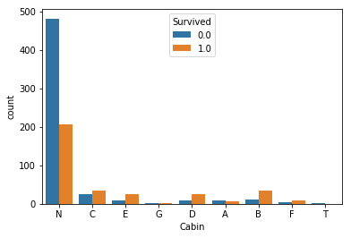


# 將類別資料轉為整數
---


```python
data['Sex'] = data['Sex'].astype('category').cat.codes
data['Embarked'] = data['Embarked'].astype('category').cat.codes
data['Pclass'] = data['Pclass'].astype('category').cat.codes
data['Title1'] = data['Title1'].astype('category').cat.codes
data['Title2'] = data['Title2'].astype('category').cat.codes
data['Cabin'] = data['Cabin'].astype('category').cat.codes
data['Ticket_info'] = data['Ticket_info'].astype('category').cat.codes
```

## 使用隨機森林來推測年齡


```python
dataAgeNull = data[data["Age"].isnull()]
dataAgeNotNull = data[data["Age"].notnull()]
remove_outlier = dataAgeNotNull[(np.abs(dataAgeNotNull["Fare"]-dataAgeNotNull["Fare"].mean())>(4*dataAgeNotNull["Fare"].std()))|
                      (np.abs(dataAgeNotNull["Family_Size"]-dataAgeNotNull["Family_Size"].mean())>(4*dataAgeNotNull["Family_Size"].std()))                     
                     ]
rfModel_age = RandomForestRegressor(n_estimators=2000,random_state=42)
ageColumns = ['Embarked', 'Fare', 'Pclass', 'Sex', 'Family_Size', 'Title1', 'Title2','Cabin','Ticket_info']
rfModel_age.fit(remove_outlier[ageColumns], remove_outlier["Age"])

ageNullValues = rfModel_age.predict(X= dataAgeNull[ageColumns])
dataAgeNull.loc[:,"Age"] = ageNullValues
data = dataAgeNull.append(dataAgeNotNull)
data.reset_index(inplace=True, drop=True)
```


```python
dataTrain = data[pd.notnull(data['Survived'])].sort_values(by=["PassengerId"])
dataTest = data[~pd.notnull(data['Survived'])].sort_values(by=["PassengerId"])
```


```python
dataTrain.columns
```


    Index(['Age', 'Cabin', 'Embarked', 'Fare', 'Name', 'Parch', 'PassengerId',
           'Pclass', 'Sex', 'SibSp', 'Survived', 'Ticket', 'Title1', 'Title2',
           'Ticket_info', 'Family_Size'],
          dtype='object')


```python
dataTrain = dataTrain[['Survived', 'Age', 'Embarked', 'Fare',  'Pclass', 'Sex', 'Family_Size', 'Title2','Ticket_info','Cabin']]
dataTest = dataTest[['Age', 'Embarked', 'Fare', 'Pclass', 'Sex', 'Family_Size', 'Title2','Ticket_info','Cabin']]
dataTrain
```


<div>
<table border="1" class="dataframe">
  <thead>
    <tr style="text-align: right;">
      <th></th>
      <th>Survived</th>
      <th>Age</th>
      <th>Embarked</th>
      <th>Fare</th>
      <th>Pclass</th>
      <th>Sex</th>
      <th>Family_Size</th>
      <th>Title2</th>
      <th>Ticket_info</th>
      <th>Cabin</th>
    </tr>
  </thead>
  <tbody>
    <tr>
      <th>263</th>
      <td>0.0</td>
      <td>22.000000</td>
      <td>2</td>
      <td>7.2500</td>
      <td>2</td>
      <td>1</td>
      <td>1</td>
      <td>2</td>
      <td>2</td>
      <td>7</td>
    </tr>
    <tr>
      <th>264</th>
      <td>1.0</td>
      <td>38.000000</td>
      <td>0</td>
      <td>71.2833</td>
      <td>0</td>
      <td>0</td>
      <td>1</td>
      <td>3</td>
      <td>14</td>
      <td>2</td>
    </tr>
    <tr>
      <th>265</th>
      <td>1.0</td>
      <td>26.000000</td>
      <td>2</td>
      <td>7.9250</td>
      <td>2</td>
      <td>0</td>
      <td>0</td>
      <td>1</td>
      <td>31</td>
      <td>7</td>
    </tr>
    <tr>
      <th>266</th>
      <td>1.0</td>
      <td>35.000000</td>
      <td>2</td>
      <td>53.1000</td>
      <td>0</td>
      <td>0</td>
      <td>1</td>
      <td>3</td>
      <td>36</td>
      <td>2</td>
    </tr>
    <tr>
      <th>267</th>
      <td>0.0</td>
      <td>35.000000</td>
      <td>2</td>
      <td>8.0500</td>
      <td>2</td>
      <td>1</td>
      <td>0</td>
      <td>2</td>
      <td>36</td>
      <td>7</td>
    </tr>
    <tr>
      <th>0</th>
      <td>0.0</td>
      <td>41.326267</td>
      <td>1</td>
      <td>8.4583</td>
      <td>2</td>
      <td>1</td>
      <td>0</td>
      <td>2</td>
      <td>36</td>
      <td>7</td>
    </tr>
    <tr>
      <th>268</th>
      <td>0.0</td>
      <td>54.000000</td>
      <td>2</td>
      <td>51.8625</td>
      <td>0</td>
      <td>1</td>
      <td>0</td>
      <td>2</td>
      <td>36</td>
      <td>4</td>
    </tr>
    <tr>
      <th>269</th>
      <td>0.0</td>
      <td>2.000000</td>
      <td>2</td>
      <td>21.0750</td>
      <td>2</td>
      <td>1</td>
      <td>4</td>
      <td>0</td>
      <td>36</td>
      <td>7</td>
    </tr>
    <tr>
      <th>270</th>
      <td>1.0</td>
      <td>27.000000</td>
      <td>2</td>
      <td>11.1333</td>
      <td>2</td>
      <td>0</td>
      <td>2</td>
      <td>3</td>
      <td>36</td>
      <td>7</td>
    </tr>
    <tr>
      <th>271</th>
      <td>1.0</td>
      <td>14.000000</td>
      <td>0</td>
      <td>30.0708</td>
      <td>1</td>
      <td>0</td>
      <td>1</td>
      <td>3</td>
      <td>36</td>
      <td>7</td>
    </tr>
    <tr>
      <th>272</th>
      <td>1.0</td>
      <td>4.000000</td>
      <td>2</td>
      <td>16.7000</td>
      <td>2</td>
      <td>0</td>
      <td>2</td>
      <td>1</td>
      <td>15</td>
      <td>6</td>
    </tr>
    <tr>
      <th>273</th>
      <td>1.0</td>
      <td>58.000000</td>
      <td>2</td>
      <td>26.5500</td>
      <td>0</td>
      <td>0</td>
      <td>0</td>
      <td>1</td>
      <td>36</td>
      <td>2</td>
    </tr>
    <tr>
      <th>274</th>
      <td>0.0</td>
      <td>20.000000</td>
      <td>2</td>
      <td>8.0500</td>
      <td>2</td>
      <td>1</td>
      <td>0</td>
      <td>2</td>
      <td>2</td>
      <td>7</td>
    </tr>
    <tr>
      <th>275</th>
      <td>0.0</td>
      <td>39.000000</td>
      <td>2</td>
      <td>31.2750</td>
      <td>2</td>
      <td>1</td>
      <td>6</td>
      <td>2</td>
      <td>36</td>
      <td>7</td>
    </tr>
    <tr>
      <th>276</th>
      <td>0.0</td>
      <td>14.000000</td>
      <td>2</td>
      <td>7.8542</td>
      <td>2</td>
      <td>0</td>
      <td>0</td>
      <td>1</td>
      <td>36</td>
      <td>7</td>
    </tr>
    <tr>
      <th>277</th>
      <td>1.0</td>
      <td>55.000000</td>
      <td>2</td>
      <td>16.0000</td>
      <td>1</td>
      <td>0</td>
      <td>0</td>
      <td>3</td>
      <td>36</td>
      <td>7</td>
    </tr>
    <tr>
      <th>278</th>
      <td>0.0</td>
      <td>2.000000</td>
      <td>1</td>
      <td>29.1250</td>
      <td>2</td>
      <td>1</td>
      <td>5</td>
      <td>0</td>
      <td>36</td>
      <td>7</td>
    </tr>
    <tr>
      <th>1</th>
      <td>1.0</td>
      <td>41.616486</td>
      <td>2</td>
      <td>13.0000</td>
      <td>1</td>
      <td>1</td>
      <td>0</td>
      <td>2</td>
      <td>36</td>
      <td>7</td>
    </tr>
    <tr>
      <th>279</th>
      <td>0.0</td>
      <td>31.000000</td>
      <td>2</td>
      <td>18.0000</td>
      <td>2</td>
      <td>0</td>
      <td>1</td>
      <td>3</td>
      <td>36</td>
      <td>7</td>
    </tr>
    <tr>
      <th>2</th>
      <td>1.0</td>
      <td>46.792625</td>
      <td>0</td>
      <td>7.2250</td>
      <td>2</td>
      <td>0</td>
      <td>0</td>
      <td>3</td>
      <td>36</td>
      <td>7</td>
    </tr>
    <tr>
      <th>280</th>
      <td>0.0</td>
      <td>35.000000</td>
      <td>2</td>
      <td>26.0000</td>
      <td>1</td>
      <td>1</td>
      <td>0</td>
      <td>2</td>
      <td>36</td>
      <td>7</td>
    </tr>
    <tr>
      <th>281</th>
      <td>1.0</td>
      <td>34.000000</td>
      <td>2</td>
      <td>13.0000</td>
      <td>1</td>
      <td>1</td>
      <td>0</td>
      <td>2</td>
      <td>36</td>
      <td>3</td>
    </tr>
    <tr>
      <th>282</th>
      <td>1.0</td>
      <td>15.000000</td>
      <td>1</td>
      <td>8.0292</td>
      <td>2</td>
      <td>0</td>
      <td>0</td>
      <td>1</td>
      <td>36</td>
      <td>7</td>
    </tr>
    <tr>
      <th>283</th>
      <td>1.0</td>
      <td>28.000000</td>
      <td>2</td>
      <td>35.5000</td>
      <td>0</td>
      <td>1</td>
      <td>0</td>
      <td>2</td>
      <td>36</td>
      <td>0</td>
    </tr>
    <tr>
      <th>284</th>
      <td>0.0</td>
      <td>8.000000</td>
      <td>2</td>
      <td>21.0750</td>
      <td>2</td>
      <td>0</td>
      <td>4</td>
      <td>1</td>
      <td>36</td>
      <td>7</td>
    </tr>
    <tr>
      <th>285</th>
      <td>1.0</td>
      <td>38.000000</td>
      <td>2</td>
      <td>31.3875</td>
      <td>2</td>
      <td>0</td>
      <td>6</td>
      <td>3</td>
      <td>36</td>
      <td>7</td>
    </tr>
    <tr>
      <th>3</th>
      <td>0.0</td>
      <td>41.326267</td>
      <td>0</td>
      <td>7.2250</td>
      <td>2</td>
      <td>1</td>
      <td>0</td>
      <td>2</td>
      <td>36</td>
      <td>7</td>
    </tr>
    <tr>
      <th>286</th>
      <td>0.0</td>
      <td>19.000000</td>
      <td>2</td>
      <td>263.0000</td>
      <td>0</td>
      <td>1</td>
      <td>5</td>
      <td>2</td>
      <td>36</td>
      <td>2</td>
    </tr>
    <tr>
      <th>4</th>
      <td>1.0</td>
      <td>34.860886</td>
      <td>1</td>
      <td>7.8792</td>
      <td>2</td>
      <td>0</td>
      <td>0</td>
      <td>1</td>
      <td>36</td>
      <td>7</td>
    </tr>
    <tr>
      <th>5</th>
      <td>0.0</td>
      <td>39.428653</td>
      <td>2</td>
      <td>7.8958</td>
      <td>2</td>
      <td>1</td>
      <td>0</td>
      <td>2</td>
      <td>36</td>
      <td>7</td>
    </tr>
    <tr>
      <th>...</th>
      <td>...</td>
      <td>...</td>
      <td>...</td>
      <td>...</td>
      <td>...</td>
      <td>...</td>
      <td>...</td>
      <td>...</td>
      <td>...</td>
      <td>...</td>
    </tr>
    <tr>
      <th>951</th>
      <td>0.0</td>
      <td>21.000000</td>
      <td>2</td>
      <td>11.5000</td>
      <td>1</td>
      <td>1</td>
      <td>1</td>
      <td>2</td>
      <td>36</td>
      <td>7</td>
    </tr>
    <tr>
      <th>952</th>
      <td>1.0</td>
      <td>48.000000</td>
      <td>2</td>
      <td>25.9292</td>
      <td>0</td>
      <td>0</td>
      <td>0</td>
      <td>3</td>
      <td>36</td>
      <td>3</td>
    </tr>
    <tr>
      <th>173</th>
      <td>0.0</td>
      <td>15.470411</td>
      <td>2</td>
      <td>69.5500</td>
      <td>2</td>
      <td>0</td>
      <td>10</td>
      <td>1</td>
      <td>7</td>
      <td>7</td>
    </tr>
    <tr>
      <th>953</th>
      <td>0.0</td>
      <td>24.000000</td>
      <td>2</td>
      <td>13.0000</td>
      <td>1</td>
      <td>1</td>
      <td>0</td>
      <td>2</td>
      <td>36</td>
      <td>7</td>
    </tr>
    <tr>
      <th>954</th>
      <td>1.0</td>
      <td>42.000000</td>
      <td>2</td>
      <td>13.0000</td>
      <td>1</td>
      <td>0</td>
      <td>0</td>
      <td>3</td>
      <td>36</td>
      <td>7</td>
    </tr>
    <tr>
      <th>955</th>
      <td>1.0</td>
      <td>27.000000</td>
      <td>0</td>
      <td>13.8583</td>
      <td>1</td>
      <td>0</td>
      <td>1</td>
      <td>1</td>
      <td>22</td>
      <td>7</td>
    </tr>
    <tr>
      <th>956</th>
      <td>0.0</td>
      <td>31.000000</td>
      <td>2</td>
      <td>50.4958</td>
      <td>0</td>
      <td>1</td>
      <td>0</td>
      <td>2</td>
      <td>14</td>
      <td>0</td>
    </tr>
    <tr>
      <th>174</th>
      <td>0.0</td>
      <td>39.428653</td>
      <td>2</td>
      <td>9.5000</td>
      <td>2</td>
      <td>1</td>
      <td>0</td>
      <td>2</td>
      <td>36</td>
      <td>7</td>
    </tr>
    <tr>
      <th>957</th>
      <td>1.0</td>
      <td>4.000000</td>
      <td>2</td>
      <td>11.1333</td>
      <td>2</td>
      <td>1</td>
      <td>2</td>
      <td>0</td>
      <td>36</td>
      <td>7</td>
    </tr>
    <tr>
      <th>958</th>
      <td>0.0</td>
      <td>26.000000</td>
      <td>2</td>
      <td>7.8958</td>
      <td>2</td>
      <td>1</td>
      <td>0</td>
      <td>2</td>
      <td>36</td>
      <td>7</td>
    </tr>
    <tr>
      <th>959</th>
      <td>1.0</td>
      <td>47.000000</td>
      <td>2</td>
      <td>52.5542</td>
      <td>0</td>
      <td>0</td>
      <td>2</td>
      <td>3</td>
      <td>36</td>
      <td>3</td>
    </tr>
    <tr>
      <th>960</th>
      <td>0.0</td>
      <td>33.000000</td>
      <td>2</td>
      <td>5.0000</td>
      <td>0</td>
      <td>1</td>
      <td>0</td>
      <td>2</td>
      <td>36</td>
      <td>1</td>
    </tr>
    <tr>
      <th>961</th>
      <td>0.0</td>
      <td>47.000000</td>
      <td>2</td>
      <td>9.0000</td>
      <td>2</td>
      <td>1</td>
      <td>0</td>
      <td>2</td>
      <td>36</td>
      <td>7</td>
    </tr>
    <tr>
      <th>962</th>
      <td>1.0</td>
      <td>28.000000</td>
      <td>0</td>
      <td>24.0000</td>
      <td>1</td>
      <td>0</td>
      <td>1</td>
      <td>3</td>
      <td>16</td>
      <td>7</td>
    </tr>
    <tr>
      <th>963</th>
      <td>1.0</td>
      <td>15.000000</td>
      <td>0</td>
      <td>7.2250</td>
      <td>2</td>
      <td>0</td>
      <td>0</td>
      <td>1</td>
      <td>36</td>
      <td>7</td>
    </tr>
    <tr>
      <th>964</th>
      <td>0.0</td>
      <td>20.000000</td>
      <td>2</td>
      <td>9.8458</td>
      <td>2</td>
      <td>1</td>
      <td>0</td>
      <td>2</td>
      <td>36</td>
      <td>7</td>
    </tr>
    <tr>
      <th>965</th>
      <td>0.0</td>
      <td>19.000000</td>
      <td>2</td>
      <td>7.8958</td>
      <td>2</td>
      <td>1</td>
      <td>0</td>
      <td>2</td>
      <td>36</td>
      <td>7</td>
    </tr>
    <tr>
      <th>175</th>
      <td>0.0</td>
      <td>39.428653</td>
      <td>2</td>
      <td>7.8958</td>
      <td>2</td>
      <td>1</td>
      <td>0</td>
      <td>2</td>
      <td>36</td>
      <td>7</td>
    </tr>
    <tr>
      <th>966</th>
      <td>1.0</td>
      <td>56.000000</td>
      <td>0</td>
      <td>83.1583</td>
      <td>0</td>
      <td>0</td>
      <td>1</td>
      <td>3</td>
      <td>36</td>
      <td>2</td>
    </tr>
    <tr>
      <th>967</th>
      <td>1.0</td>
      <td>25.000000</td>
      <td>2</td>
      <td>26.0000</td>
      <td>1</td>
      <td>0</td>
      <td>1</td>
      <td>3</td>
      <td>36</td>
      <td>7</td>
    </tr>
    <tr>
      <th>968</th>
      <td>0.0</td>
      <td>33.000000</td>
      <td>2</td>
      <td>7.8958</td>
      <td>2</td>
      <td>1</td>
      <td>0</td>
      <td>2</td>
      <td>36</td>
      <td>7</td>
    </tr>
    <tr>
      <th>969</th>
      <td>0.0</td>
      <td>22.000000</td>
      <td>2</td>
      <td>10.5167</td>
      <td>2</td>
      <td>0</td>
      <td>0</td>
      <td>1</td>
      <td>36</td>
      <td>7</td>
    </tr>
    <tr>
      <th>970</th>
      <td>0.0</td>
      <td>28.000000</td>
      <td>2</td>
      <td>10.5000</td>
      <td>1</td>
      <td>1</td>
      <td>0</td>
      <td>2</td>
      <td>8</td>
      <td>7</td>
    </tr>
    <tr>
      <th>971</th>
      <td>0.0</td>
      <td>25.000000</td>
      <td>2</td>
      <td>7.0500</td>
      <td>2</td>
      <td>1</td>
      <td>0</td>
      <td>2</td>
      <td>28</td>
      <td>7</td>
    </tr>
    <tr>
      <th>972</th>
      <td>0.0</td>
      <td>39.000000</td>
      <td>1</td>
      <td>29.1250</td>
      <td>2</td>
      <td>0</td>
      <td>5</td>
      <td>3</td>
      <td>36</td>
      <td>7</td>
    </tr>
    <tr>
      <th>973</th>
      <td>0.0</td>
      <td>27.000000</td>
      <td>2</td>
      <td>13.0000</td>
      <td>1</td>
      <td>1</td>
      <td>0</td>
      <td>2</td>
      <td>36</td>
      <td>7</td>
    </tr>
    <tr>
      <th>974</th>
      <td>1.0</td>
      <td>19.000000</td>
      <td>2</td>
      <td>30.0000</td>
      <td>0</td>
      <td>0</td>
      <td>0</td>
      <td>1</td>
      <td>36</td>
      <td>1</td>
    </tr>
    <tr>
      <th>176</th>
      <td>0.0</td>
      <td>19.099409</td>
      <td>2</td>
      <td>23.4500</td>
      <td>2</td>
      <td>0</td>
      <td>3</td>
      <td>1</td>
      <td>34</td>
      <td>7</td>
    </tr>
    <tr>
      <th>975</th>
      <td>1.0</td>
      <td>26.000000</td>
      <td>0</td>
      <td>30.0000</td>
      <td>0</td>
      <td>1</td>
      <td>0</td>
      <td>2</td>
      <td>36</td>
      <td>2</td>
    </tr>
    <tr>
      <th>976</th>
      <td>0.0</td>
      <td>32.000000</td>
      <td>1</td>
      <td>7.7500</td>
      <td>2</td>
      <td>1</td>
      <td>0</td>
      <td>2</td>
      <td>36</td>
      <td>7</td>
    </tr>
  </tbody>
</table>
<p>891 rows × 10 columns</p>
</div>


# 載入隨機森林演算法(Random Forest)來預測存活率
---


```python
from sklearn.ensemble import RandomForestClassifier
 
rf = RandomForestClassifier(criterion='gini', 
                             n_estimators=1000,
                             min_samples_split=12,
                             min_samples_leaf=1,
                             oob_score=True,
                             random_state=1,
                             n_jobs=-1) 

rf.fit(dataTrain.iloc[:, 1:], dataTrain.iloc[:, 0])
print("%.4f" % rf.oob_score_)
```

    0.8294
    


```python
pd.concat((pd.DataFrame(dataTrain.iloc[:, 1:].columns, columns = ['variable']), 
           pd.DataFrame(rf.feature_importances_, columns = ['importance'])), 
          axis = 1).sort_values(by='importance', ascending = False)[:20]
```


<div>
<table border="1" class="dataframe">
  <thead>
    <tr style="text-align: right;">
      <th></th>
      <th>variable</th>
      <th>importance</th>
    </tr>
  </thead>
  <tbody>
    <tr>
      <th>4</th>
      <td>Sex</td>
      <td>0.264997</td>
    </tr>
    <tr>
      <th>2</th>
      <td>Fare</td>
      <td>0.163890</td>
    </tr>
    <tr>
      <th>6</th>
      <td>Title2</td>
      <td>0.152698</td>
    </tr>
    <tr>
      <th>0</th>
      <td>Age</td>
      <td>0.131891</td>
    </tr>
    <tr>
      <th>3</th>
      <td>Pclass</td>
      <td>0.091048</td>
    </tr>
    <tr>
      <th>5</th>
      <td>Family_Size</td>
      <td>0.070839</td>
    </tr>
    <tr>
      <th>8</th>
      <td>Cabin</td>
      <td>0.067029</td>
    </tr>
    <tr>
      <th>7</th>
      <td>Ticket_info</td>
      <td>0.031735</td>
    </tr>
    <tr>
      <th>1</th>
      <td>Embarked</td>
      <td>0.025873</td>
    </tr>
  </tbody>
</table>
</div>


```python
rf_res =  rf.predict(dataTest)
submit['Survived'] = rf_res
submit['Survived'] = submit['Survived'].astype(int)
submit.to_csv('submit.csv', index= False)
```


```python
submit
```


<div>
<table border="1" class="dataframe">
  <thead>
    <tr style="text-align: right;">
      <th></th>
      <th>PassengerId</th>
      <th>Survived</th>
    </tr>
  </thead>
  <tbody>
    <tr>
      <th>0</th>
      <td>892</td>
      <td>0</td>
    </tr>
    <tr>
      <th>1</th>
      <td>893</td>
      <td>1</td>
    </tr>
    <tr>
      <th>2</th>
      <td>894</td>
      <td>0</td>
    </tr>
    <tr>
      <th>3</th>
      <td>895</td>
      <td>0</td>
    </tr>
    <tr>
      <th>4</th>
      <td>896</td>
      <td>1</td>
    </tr>
    <tr>
      <th>5</th>
      <td>897</td>
      <td>0</td>
    </tr>
    <tr>
      <th>6</th>
      <td>898</td>
      <td>0</td>
    </tr>
    <tr>
      <th>7</th>
      <td>899</td>
      <td>0</td>
    </tr>
    <tr>
      <th>8</th>
      <td>900</td>
      <td>1</td>
    </tr>
    <tr>
      <th>9</th>
      <td>901</td>
      <td>0</td>
    </tr>
    <tr>
      <th>10</th>
      <td>902</td>
      <td>0</td>
    </tr>
    <tr>
      <th>11</th>
      <td>903</td>
      <td>0</td>
    </tr>
    <tr>
      <th>12</th>
      <td>904</td>
      <td>1</td>
    </tr>
    <tr>
      <th>13</th>
      <td>905</td>
      <td>0</td>
    </tr>
    <tr>
      <th>14</th>
      <td>906</td>
      <td>1</td>
    </tr>
    <tr>
      <th>15</th>
      <td>907</td>
      <td>1</td>
    </tr>
    <tr>
      <th>16</th>
      <td>908</td>
      <td>0</td>
    </tr>
    <tr>
      <th>17</th>
      <td>909</td>
      <td>0</td>
    </tr>
    <tr>
      <th>18</th>
      <td>910</td>
      <td>0</td>
    </tr>
    <tr>
      <th>19</th>
      <td>911</td>
      <td>1</td>
    </tr>
    <tr>
      <th>20</th>
      <td>912</td>
      <td>0</td>
    </tr>
    <tr>
      <th>21</th>
      <td>913</td>
      <td>1</td>
    </tr>
    <tr>
      <th>22</th>
      <td>914</td>
      <td>1</td>
    </tr>
    <tr>
      <th>23</th>
      <td>915</td>
      <td>0</td>
    </tr>
    <tr>
      <th>24</th>
      <td>916</td>
      <td>1</td>
    </tr>
    <tr>
      <th>25</th>
      <td>917</td>
      <td>0</td>
    </tr>
    <tr>
      <th>26</th>
      <td>918</td>
      <td>1</td>
    </tr>
    <tr>
      <th>27</th>
      <td>919</td>
      <td>0</td>
    </tr>
    <tr>
      <th>28</th>
      <td>920</td>
      <td>1</td>
    </tr>
    <tr>
      <th>29</th>
      <td>921</td>
      <td>0</td>
    </tr>
    <tr>
      <th>...</th>
      <td>...</td>
      <td>...</td>
    </tr>
    <tr>
      <th>388</th>
      <td>1280</td>
      <td>0</td>
    </tr>
    <tr>
      <th>389</th>
      <td>1281</td>
      <td>0</td>
    </tr>
    <tr>
      <th>390</th>
      <td>1282</td>
      <td>0</td>
    </tr>
    <tr>
      <th>391</th>
      <td>1283</td>
      <td>1</td>
    </tr>
    <tr>
      <th>392</th>
      <td>1284</td>
      <td>1</td>
    </tr>
    <tr>
      <th>393</th>
      <td>1285</td>
      <td>0</td>
    </tr>
    <tr>
      <th>394</th>
      <td>1286</td>
      <td>0</td>
    </tr>
    <tr>
      <th>395</th>
      <td>1287</td>
      <td>1</td>
    </tr>
    <tr>
      <th>396</th>
      <td>1288</td>
      <td>0</td>
    </tr>
    <tr>
      <th>397</th>
      <td>1289</td>
      <td>1</td>
    </tr>
    <tr>
      <th>398</th>
      <td>1290</td>
      <td>0</td>
    </tr>
    <tr>
      <th>399</th>
      <td>1291</td>
      <td>0</td>
    </tr>
    <tr>
      <th>400</th>
      <td>1292</td>
      <td>1</td>
    </tr>
    <tr>
      <th>401</th>
      <td>1293</td>
      <td>0</td>
    </tr>
    <tr>
      <th>402</th>
      <td>1294</td>
      <td>1</td>
    </tr>
    <tr>
      <th>403</th>
      <td>1295</td>
      <td>0</td>
    </tr>
    <tr>
      <th>404</th>
      <td>1296</td>
      <td>0</td>
    </tr>
    <tr>
      <th>405</th>
      <td>1297</td>
      <td>0</td>
    </tr>
    <tr>
      <th>406</th>
      <td>1298</td>
      <td>0</td>
    </tr>
    <tr>
      <th>407</th>
      <td>1299</td>
      <td>0</td>
    </tr>
    <tr>
      <th>408</th>
      <td>1300</td>
      <td>1</td>
    </tr>
    <tr>
      <th>409</th>
      <td>1301</td>
      <td>1</td>
    </tr>
    <tr>
      <th>410</th>
      <td>1302</td>
      <td>1</td>
    </tr>
    <tr>
      <th>411</th>
      <td>1303</td>
      <td>1</td>
    </tr>
    <tr>
      <th>412</th>
      <td>1304</td>
      <td>0</td>
    </tr>
    <tr>
      <th>413</th>
      <td>1305</td>
      <td>0</td>
    </tr>
    <tr>
      <th>414</th>
      <td>1306</td>
      <td>1</td>
    </tr>
    <tr>
      <th>415</th>
      <td>1307</td>
      <td>0</td>
    </tr>
    <tr>
      <th>416</th>
      <td>1308</td>
      <td>0</td>
    </tr>
    <tr>
      <th>417</th>
      <td>1309</td>
      <td>1</td>
    </tr>
  </tbody>
</table>
<p>418 rows × 2 columns</p>
</div>


